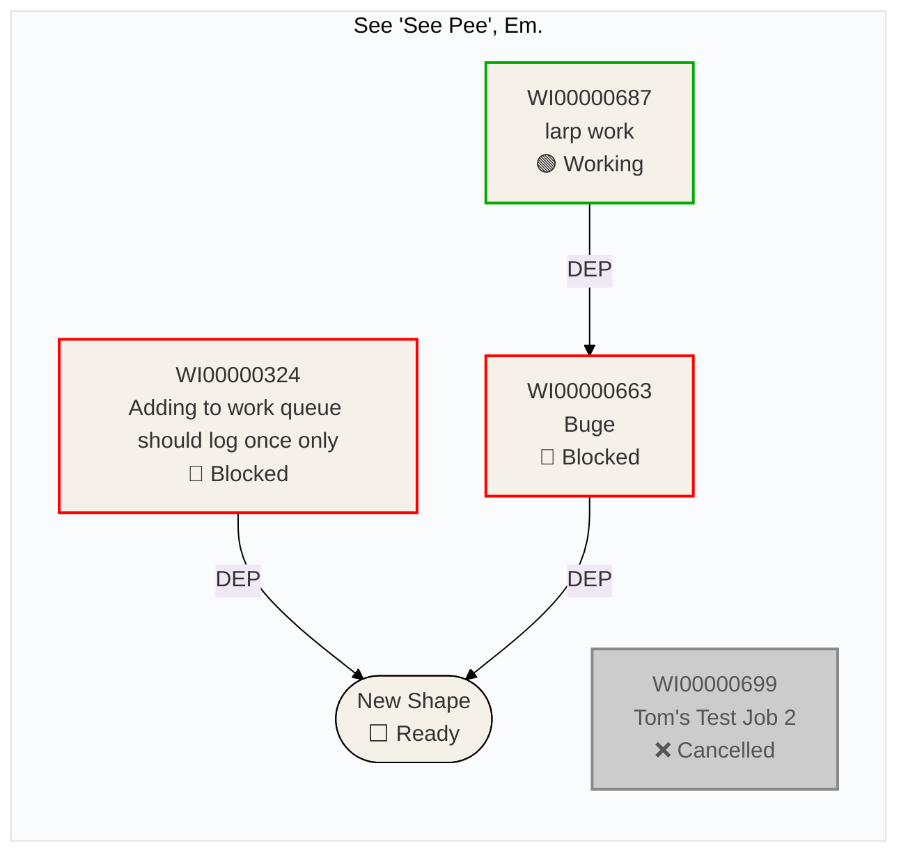
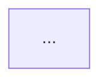

# PAVE workflow: visualize NCN diagram

Use this workflow to generate a Mermaid flowchart diagram from the network visualization data returned by `pave-ncn-get-diagrams`.

## 1) Call `pave-ncn-get-diagrams`

```
pave-ncn-get-diagrams(jobNumber: "WI..." | "CS..." | "PRJ...")
```

This returns one or more diagrams. Each diagram contains:

- A **breakdown** tree of shapes (with `shapeId`, `name`, `type`, `status`, `jobNumber`, `depth`, `lastUpdate`, `completedTime`)
- A **connections** array of dependency arrows (with `fromShapeId`, `toShapeId`, `type`, `isDecoupled`, `isValid`)

## 2) Extract shapes from the breakdown

For each shape in the breakdown, collect:

- `shapeId` → sanitize to a valid Mermaid node ID: strip hyphens from the GUID first, then take the first 8 characters, and prefix with `shape_`
- `jobNumber` → first line of the label (if present)
- `name` → second line of the label, preserving the source value exactly as returned in breakdown
- `type` → determines Mermaid node shape and styling
- `status` → determines border colour style directive
- `depth` → used to group shapes under the root diagram (`depth: 0`) via `subgraph`

### Label format

Put `jobNumber` **first**, then `name`, using `<br/>` for line breaks:

```
"WI00000687<br/>larp work<br/>🟢 Working"
```

If there is no `jobNumber`, omit it:

```
"New Shape<br/>⬜ Ready"
```

Use the breakdown `name` verbatim in labels. Example:

```
"WI00000663<br/>Full shape name exactly as returned<br/>🟢 Working"
```

Do not normalize, clean, trim, rewrite, or shorten shape label text.

Append a status line using this mapping:

| Status        | Label suffix     |
| ------------- | ---------------- |
| `Working`     | `🟢 Working`     |
| `Blocked`     | `🔴 Blocked`     |
| `Cancelled`   | `❌ Cancelled`   |
| `Closed`      | `✅ Closed`      |
| `Ready`       | `⬜ Ready`       |
| `NotAchieved` | `⭕ NotAchieved` |

Before inserting any rendered label text into Mermaid, escape Mermaid-sensitive characters in node labels and subgraph labels:

- `"` → `&quot;`
- `|` → `&#124;`
- `{` → `&#123;`
- `}` → `&#125;`

### Theme and background

Always set a white background and beige node fill using the `init` directive at the top of the diagram:

```
%%{init: {'theme': 'base', 'themeVariables': {'background': '#ffffff', 'primaryColor': '#f5f0e8'}}}%%
```

### Status style mapping

Emit a `style` directive for each shape combining `fill` and `stroke` based on status:

| Status        | `fill`            | `stroke`                                                  |
| ------------- | ----------------- | --------------------------------------------------------- |
| `Working`     | `#f5f0e8` (beige) | `#00aa00` (green) `stroke-width:2px`                      |
| `Blocked`     | `#f5f0e8` (beige) | `#ff0000` (red) `stroke-width:2px`                        |
| `Cancelled`   | `#cccccc` (grey)  | `#888888` (dark grey) `stroke-width:2px`, `color:#555555` |
| `Closed`      | `#f5f0e8` (beige) | `#888888` (grey) `stroke-width:1px`                       |
| `Ready`       | `#f5f0e8` (beige) | `#000000` (black) `stroke-width:1px`                      |
| `NotAchieved` | `#f5f0e8` (beige) | `#ff8800` (orange) `stroke-width:2px`                     |

External placeholder nodes use a dashed border:

```
style shape_7b8e7f07 fill:#f5f0e8,stroke:#aaaaaa,stroke-width:1px,stroke-dasharray:4
```

### Node shape mapping

| Type                                        | Mermaid syntax                                               | Notes                                                       |
| ------------------------------------------- | ------------------------------------------------------------ | ----------------------------------------------------------- |
| `WorkItem`, `Project`, `Job`, `Deliverable` | `["label"]` (rectangle)                                      | Standard task box                                           |
| `Milestone`                                 | `(["label"])` (stadium)                                      | Rounded pill shape                                          |
| `Shape`                                     | `["label"]` (rectangle)                                      | Generic shape - treat as task                               |
| `Buffer`                                    | `(["label"])` (stadium) with `fill:#4169e1,color:#fff` style | Blue background to approximate buffer colouring             |
| `Diagram`                                   | `{{"label"}}` (hexagon)                                      | Root diagram node (Depth 0), usually omitted from node list |

> **Note:** Buffer shapes in the actual UI show a tri-colour consumption bar (blue/yellow/red zones) which cannot be replicated in Mermaid. Use a blue-filled stadium shape as the closest approximation.

## 3) Extract connections

For each entry in the connections array:

- **Skip** connections where `fromShapeId` is `null` - these are buffer entry points with no renderable source.
- **Include all other connections** regardless of `isValid` value - `isValid: false` connections are still rendered in the actual diagram.
- If `fromShapeId` or `toShapeId` references a GUID **not found in the breakdown**, declare it as an external placeholder node and include the arrow:
  ```
  shape_7b8e7f07["(external shape)"]
  ```
- Map `fromShapeId` and `toShapeId` to sanitized node IDs using the same GUID → 8-char prefix scheme.

### Arrow style mapping

| Connection type | Mermaid arrow   | Notes                |
| --------------- | --------------- | -------------------- |
| `DEP`           | `-->` (solid)   | Standard dependency  |
| `BUF`           | `-.->` (dashed) | Buffer feeding arrow |
| `RES`           | `-->` (solid)   | Resource link        |
| `SCL`           | `-.->` (dotted) | Schedule link        |

## 4) Generate the Mermaid flowchart

Use `flowchart LR` (left-to-right) to match the actual diagram orientation. Group shapes by their root diagram using `subgraph` blocks (the depth-0 shape name becomes the subgraph label; all deeper shapes are nested within). Omit the depth-0 Diagram shape itself as a node - use it only as the subgraph label.

After all node declarations, emit `style` directives for status border colours, then buffer fill colours.

### Example output



## 5) Return the Mermaid code block to the user

Wrap the generated flowchart in a fenced `mermaid` code block so it renders in chat or markdown viewers:

````markdown

````

## Tips

- Always include the `%%{init: ...}%%` directive with white background and beige `primaryColor` at the top of every diagram.
- Use `flowchart LR` (not `TD`) - the actual NCN diagram lays out left-to-right.
- Put `jobNumber` as the **first line** of a node label, before the name.
- Emit `style` directives after node declarations to apply status-based border colours.
- Skip connections where `fromShapeId` is `null` - they have no renderable source.
- Do **not** filter out connections with `isValid: false` - they are rendered in the actual diagram.
- For connections referencing shapes outside the breakdown, add a placeholder node rather than dropping the arrow.
- Buffer shapes (`Type: Buffer`) should use a blue-filled stadium to distinguish them visually from regular shapes.
- If the job has multiple diagrams, generate one `subgraph` per diagram.
- Keep node IDs short and consistent - strip hyphens from GUIDs, take the first 8 characters, prefix with `shape_`.
