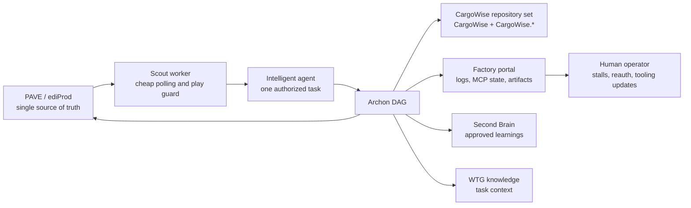

# PAVE Dark Factory Worker

This repository is being reframed as a **WiseTech Global PAVE-driven dark factory worker** for CargoWise development tasks.

PAVE is the single source of truth. The worker discovers startable PAVE tasks, claims them safely through ediProd, executes an Archon workflow against the appropriate CargoWise repository set, and reports the resulting agentic artifacts back to the work item or incident. The web surface in this repo is now the **factory control portal**, not the product being built.

The original DynaChat chat/RAG application remains in the tree as inherited scaffold and an implementation harness. It is not the mission of this repository anymore.

---

## What This Worker Does

The target operating model is:

1. A small scout worker polls a configured PAVE board with low token cost.
2. The scout only chooses a task when the staff code has no other playing task.
3. The scout creates a compact task handoff for the intelligent agent.
4. The agent claims and starts exactly one PAVE task through ediProd.
5. Archon executes a deterministic DAG for research, repo-set planning, implementation, validation, critic review, evidence reporting, close/suspend handling, and self-learning.
6. All instances report telemetry, logs, MCP readiness, PR sets, artifacts, critic output, and evidence status to the central portal.
7. The final evidence report is written to the job eDoc and contains the same full log shown in the dashboard.

The worker is designed for CargoWise work, including changes that span the large `CargoWise` repository and one or more sibling `CargoWise.*` module repositories. A single PAVE work item can therefore result in multiple branches, multiple pull requests, and per-repository build/test evidence.

---

## Source Of Truth

PAVE owns:

- work discovery and prioritisation;
- task lifecycle state: claim, start, suspend, resume, complete, cancel;
- work item / incident context and final updates;
- staff-code play constraints;
- the audit trail for generated artifacts.

The portal mirrors operational state. It must not become a second work queue. GitHub remains the source control and pull-request surface only.

Required MCP services:

- `ediprod`: PAVE lifecycle, work item / incident updates, task notes, eDoc evidence.
- `wtgkb`: current WTG and CargoWise knowledge for the task being executed.
- `sbkb`: durable Second Brain learning capture during dedicated self-learning tasks.

If any required MCP is stale, unauthenticated, unauthorized, or missing, the affected scout or executor pauses. The dashboard must show the stalled state and expose the reauthentication/update action rather than letting the worker continue with partial trust.

---

## Local Services

Use the service controller to run the backend, frontend, and scout worker:

```powershell
.\scripts\factory-services.ps1 start
.\scripts\factory-services.ps1 status
.\scripts\factory-services.ps1 stop
.\scripts\factory-services.ps1 restart
```

The dashboard is served by the Vite app at:

```text
http://127.0.0.1:5173/factory
```

The script creates a worker token at `.factory/factory-worker-token.txt`, stores service PIDs in `.factory/pids`, and writes logs in `.factory/logs`.

Default local operating inputs:

- PAVE board: `Peter's Board`
- staff code: `PWS`

Override these with script parameters or environment variables when running another worker pool.

---

## Database

Factory portal state defaults to SQL Server because that is the WTG operational database standard:

```powershell
$env:FACTORY_STORAGE_PROVIDER = "sqlserver"
$env:FACTORY_SQLSERVER_CONNECTION_STRING = "Driver={ODBC Driver 18 for SQL Server};Server=YOURSERVER;Database=DarkFactory;Trusted_Connection=yes;TrustServerCertificate=yes;"
```

The SQL Server repository creates factory tables idempotently and stores JSON-shaped fields as `NVARCHAR(MAX)` payloads.

The inherited chat/RAG scaffold still requires its original `DATABASE_URL` Postgres/pgvector database. Migrating that legacy retrieval code to SQL Server is a separate task because it depends on Postgres full-text search and pgvector.

---

## Architecture



Important design constraints:

- The scout is cheap and conservative. It polls PAVE, checks the staff-code play guard, and passes only compact task context to the expensive agent.
- Claim safety comes from PAVE lifecycle operations, not portal-side locks.
- A task must not start if starting it would suspend another playing task for the staff code.
- The critic is a normal Archon DAG node.
- Self-learning is a dedicated PAVE task at the end of the work item or incident lifecycle.
- Skills/plugins are versioned operational dependencies. The portal tracks installed versions, latest known versions, update status, and update jobs.

---

## Key Paths

| Path | Purpose |
| --- | --- |
| `app/backend/factory/worker.py` | Scout worker entry point. |
| `app/backend/routes/factory.py` | Factory portal API. |
| `app/backend/db/factory_store.py` | Factory storage provider selector. |
| `app/backend/db/factory_sqlserver_repository.py` | SQL Server factory storage. |
| `app/frontend/src/pages/FactoryDashboard.tsx` | Central factory dashboard. |
| `.archon/workflows/pave-dark-factory-execute-task.yaml` | PAVE-native execution workflow. |
| `.archon/commands/dark-factory-pave-*.md` | Archon command contracts for PAVE execution. |
| `docs/dark-factory-pave-single-source-report.md` | Deep implementation handoff report. |
| `docs/pave-factory-implementation-decisions.md` | Assumptions and decisions log. |
| `scripts/factory-services.ps1` | Start/stop/status controller. |

---

## Legacy App Harness

The inherited FastAPI/React code still includes a RAG chat application. It exists because the upstream dark factory experiment shipped as a web app, and the current branch reuses that authenticated frontend/backend shell for the factory portal.

Legacy chat routes remain available for now:

- `/chat`
- `/c/:conversationId`
- `/admin`

The default authenticated route is `/factory`.

Do not treat legacy DynaChat requirements as the mission for new work. New work should serve the PAVE/CargoWise worker unless a PAVE task explicitly targets legacy scaffold cleanup.

---

## Implementation Status

Implemented in this branch:

- PAVE factory portal backend API.
- SQL Server factory storage path, with Postgres compatibility retained.
- Scout worker skeleton with fail-closed MCP readiness behavior.
- Dashboard views for runs, stalled MCPs, tooling currency, artifacts, critic reports, evidence logs, and learning assessments.
- PAVE-native Archon workflow and command files.
- Local service controller for start, stop, restart, and status.

Known live-tool constraint:

- `ediprod`, `wtgkb`, and `sbkb` are configured in Codex, but the callable ediProd mutation namespace was not exposed to this implementation thread and the local `edi` CLI fallback was not installed.
- Until a concrete ediProd/PAVE lifecycle adapter is callable at runtime, the scout must remain stalled before polling, claiming, starting, suspending, completing, assigning, or uploading eDoc evidence.

---

## Validation

Focused local validation commands:

```powershell
cd app
uv --project backend run python -m compileall -q backend/main.py backend/config.py backend/factory backend/db/factory_store.py backend/db/factory_sqlserver_repository.py backend/routes/factory.py

cd frontend
bun run type-check
bunx biome check src/pages/FactoryDashboard.tsx src/components/BrandingHeader.tsx src/App.tsx src/lib/api.ts
```

The full inherited chat/RAG test suite still belongs to the legacy scaffold. Factory changes should prefer targeted backend, frontend, service-control, and Archon workflow validation unless the PAVE task touches chat/RAG behavior directly.
