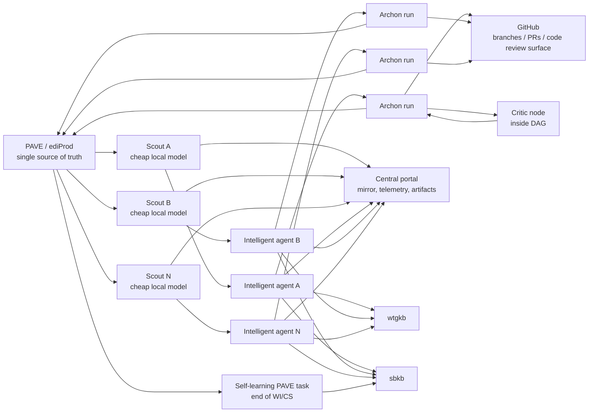

# Dark Factory PAVE Single Source Report

Generated: 2026-06-10

## Purpose

This report is a coding handoff for evolving the current Dark Factory experiment so that PAVE is the driving single source of truth for work discovery, claim/start, execution status, and final agentic reporting.

The requested target is:

- Many worker instances run concurrently.
- Each instance uses the WTG MCP services:
  - `ediprod` for PAVE, work items, incidents, workflows, tasks, notes, documents, and updates.
  - `wtgkb` for WTG knowledge and historical work-item/incident/documentation lookup.
  - `sbkb` for Second Brain local decisions and reusable agent memory.
- Workers discover truly-startable PAVE work, claim it safely, execute an Archon workflow, and report specs/coding/review/validation artifacts back to the work item or incident.
- All workers report operational telemetry and artifacts to a central web portal.
- PAVE polling is handled by a small, low-token scout worker using a local LLM or deterministic ranking. The expensive agent is invoked only after the scout confirms the staff code has no task already playing and has selected a safe candidate.
- Critic behavior is an explicit node inside the Archon DAG, not an informal afterthought.
- Self-learning is a dedicated PAVE task at the end of the work item/incident lifecycle. It compares generated artifacts with the artifacts actually used, surfaces manual-change learnings, and writes durable learnings to the WTG Second Brain as draft, ready for approval.

The initial version of this document was a report-only handoff. The repository now contains an implementation slice for the portal, scout worker, Archon PAVE workflow assets, and local service controls. The remaining hard dependency is a concrete callable ediProd/PAVE lifecycle adapter for claim/start/suspend/complete/eDoc upload.

## Implementation Snapshot Added 2026-06-10

Implemented in this branch:

- Fork/branch target: `wetware0/dark-factory-experiment`, branch `codex/pave-dark-factory-wetware0`.
- Durable assumptions and decisions log: `docs/pave-factory-implementation-decisions.md`.
- Portal database schema: `app/backend/alembic/versions/0006_pave_factory_portal.py`.
- Factory repository/API layer: `app/backend/db/factory_repository.py`, `app/backend/routes/factory.py`, registered in `app/backend/main.py`.
- Scout worker CLI: `app/backend/factory/worker.py`.
- Local service control: `scripts/factory-services.ps1`.
- Dashboard route: `/factory`, implemented in `app/frontend/src/pages/FactoryDashboard.tsx` and `app/frontend/src/lib/api.ts`.
- PAVE-native Archon workflow and commands:
  - `.archon/workflows/pave-dark-factory-execute-task.yaml`
  - `.archon/commands/dark-factory-pave-*.md`

Current live-tool finding:

- `codex mcp list` reports `ediprod`, `wtgkb`, and `sbkb` are configured.
- The callable `ediprod` MCP mutation namespace was not exposed to this implementation thread.
- The local `edi` CLI fallback was not installed.
- Therefore the scout records `ediprod` as unavailable for mutation and stalls safely before PAVE polling/claiming. This is expected until the runtime has a concrete PAVE adapter.

Local service commands:

```powershell
.\scripts\factory-services.ps1 start
.\scripts\factory-services.ps1 status
.\scripts\factory-services.ps1 stop
.\scripts\factory-services.ps1 restart
```

The service script starts the backend, frontend, and scout worker, creates `.factory/factory-worker-token.txt` when needed, stores PID files under `.factory/pids`, and writes logs under `.factory/logs`. The dashboard is available at `http://127.0.0.1:5173/factory` when services start successfully.

## Inputs Reviewed

Repository-local:

- `README.md`: current Dark Factory architecture, GitHub-label state machine, Archon workflow list.
- `FACTORY_RULES.md`: validation gates, throughput controls, holdout principle, artifact rules.
- `.archon/workflows/dark-factory-triage.yaml`: current issue triage workflow.
- `.archon/workflows/dark-factory-fix-github-issue.yaml`: current implementation workflow.
- `.archon/workflows/dark-factory-validate-pr.yaml`: current holdout validation workflow.
- `.archon/commands/dark-factory-*.md`: current command contracts and artifact expectations.
- `app/backend/main.py`, `app/backend/db/repository.py`, `app/backend/alembic/versions/0001_initial.py`: current FastAPI/Postgres shape.
- `app/frontend/src/App.tsx`, `app/frontend/src/lib/api.ts`: current frontend route/API pattern.

WTG/PAVE-specific:

- `pave` skill: task lifecycle, `tasks-action`, task CRUD, notes, PAVE project and NCN guidance.
- `ediprod` skill: work items, incidents, projects, workflows, tasks, staff, notes, document tools.
- `find-startable-work` skill: current true-startable rule and safe claim behavior.
- `wtgkb` live search: found ediProd MCP reference, PAVE workflow/background docs, and current work items on PAVE agent work locator, quality iteration, scope authorization, and incident updates.
- `sbkb_status`: confirmed local Second Brain is reachable at `C:\git\SecondBrain`, with embeddings enabled.
- `codex mcp list`: confirmed `ediprod` and `wtgkb` are enabled with OAuth, and `sbkb` is enabled as a local MCP server.
- `C:\git\WTG.sbkb-mcp\README.md`: Second Brain MCP exposes status, search/fetch, create/update note, link, neighbourhood, and traversal operations; production workers should use `SBKB_VAULT_ROOT=C:\git\SecondBrain` and `SBKB_REPO_OVERLAY=auto`.
- `C:\git\SecondBrain\README.md` and `.mcp.json`: confirms the local vault and MCP launch shape for the Second Brain.
- `WiseTechGlobal/WTG.AI.Prompts` via GitHub CLI: private prompt/plugin repository is visible and contains phase-relevant plugin families including `pave-locator`, `ediprod-triage`, `development`, `cargowise`, and domain-specific CargoWise plugins.
- `wtgkb` live search: confirmed WTG.AI.Prompts content and recent PAVE/skill work are retrievable through WTG knowledge search, so workers should use `wtgkb` to locate current prompt/skill guidance rather than assuming a local clone exists.
- User clarification: CargoWise implementation work is modular. The large `CargoWise` repo is used with multiple sibling `CargoWise.*` repositories containing C# modules that may be required for a single PAVE task.
- `cw-coding` skill: CargoWise work requires affected project/module builds, new or updated tests for changed business logic, analyzer validation, respect for generated `Auto*` code, and multi-targeting awareness.

## Current Experiment Baseline

The current repository is not PAVE-driven. It is a DynaChat web app plus an Archon-based Dark Factory automation layer.

Current control flow:

1. GitHub issues are the intake queue.
2. GitHub labels are the state machine:
  - Issues: `factory:accepted`, `factory:in-progress`, `factory:rejected`, `factory:needs-human`.
  - PRs: `factory:needs-review`, `factory:needs-fix`, `factory:approved`, `factory:needs-human`.
3. Archon runs workflows from `.archon/workflows/`.
4. Implementation creates a GitHub PR.
5. Validation uses a separate holdout workflow, reads the issue and diff, and deliberately avoids implementation artifacts.
6. Artifacts are written under `$ARTIFACTS_DIR` inside the Archon run.

The important existing design assets to preserve are:

- Deterministic shell nodes for repeatable actions.
- Fresh-context AI nodes between phases.
- The holdout principle: validators do not see coder plans, investigation notes, or implementation rationale.
- Artifact files as the internal workflow handoff mechanism.
- Bounded parallelism and per-target locking.
- Explicit quality gates before merge.

The important current limitation is that GitHub, not PAVE, is the source of operational truth. To satisfy the requested design, the orchestrator must stop treating GitHub labels as the primary queue and instead use PAVE task state as the primary queue.

## Target Architecture

Recommended shape:



Core rule:

PAVE owns the work. The portal owns observability. GitHub owns high-level design, specification, source code, code review, and merge mechanics. Archon owns execution. Knowledge bases own context. Do not let the portal or GitHub become a second queue. GitHub labels are used for information purposes to show dark factory interaction.

Polling is separated from deep reasoning. The scout performs cheap, frequent PAVE checks and candidate selection. The intelligent agent performs expensive context gathering, implementation, validation, and reporting only after the scout has produced a claimed or claim-ready task handoff.

## Design Decisions

### Decision 1: PAVE Is Authoritative

PAVE should be authoritative for:

- Which work exists.
- Whether work is startable.
- Which staff or capability owns the task.
- Whether a task is claimed, started, suspended, completed, or cancelled.
- Job/workflow/task notes that humans will inspect.
- Work item or incident summaries/details updated by the agent.
- Full business-facing artifacts attached or linked to the job.

The portal should mirror PAVE and run status. It should not contain a separate "work queue" that agents consume independently.

### Decision 2: The Portal Is a Control Plane, Not a Scheduler

The central portal should answer:

- Which instances are alive?
- Which PAVE board/staff/capability each instance is allowed to use?
- Which task did each instance claim?
- What Archon run is active?
- What artifacts were produced?
- What was posted back to ediProd?
- What failed and why?

The portal should not assign tasks by itself unless it delegates the final claim/start mutation back through `ediprod` and records the result as a mirror.

### Decision 3: Claim Safety Comes From PAVE

Safe concurrency should rely on PAVE lifecycle mutations, not portal-side optimistic flags.

The worker flow should be:

1. Discover candidates from PAVE.
2. Select one candidate.
3. Execute an atomic PAVE claim/start operation.
4. Treat claim failure as a lost race.
5. Never execute work unless the PAVE claim/start succeeded or dry-run mode is explicitly enabled.

The portal can record attempted claims, but an attempted claim does not authorize work.

### Decision 4: Bridge GitHub, Do Not Replace It Immediately

The current Archon implementation expects GitHub issues and PR labels. Replacing all GitHub state in one pass is high risk.

Recommended migration:

- Phase 1: Add PAVE-driven worker orchestration while keeping GitHub PRs for code review and merge.
- Phase 2: Add PAVE-native Archon workflows that accept `jobNumber`, `taskId`, and `workflowId` as first-class inputs.
- Phase 3: Retire GitHub issue intake for factory-owned work, but keep PRs as code review artifacts.

GitHub issues may be useful as temporary bridge artifacts, but they must not become the source of truth. If a synthetic GitHub issue is created, it should contain a PAVE pointer and be marked as derived state.

### Decision 5: Keep Holdout Isolation

The existing holdout principle is still required in the PAVE design.

The validator should read:

- The PAVE job/task contract as it existed at claim time.
- Current PAVE job/task data needed to validate outcome.
- The PR diff.
- Test and E2E outputs generated by validation itself.
- Governance/rule files from base branch.

The validator must not read:

- The coder's investigation artifacts.
- The coder's implementation plan.
- Prior self-reported success notes.
- The worker's private scratch context.

PAVE reporting must therefore distinguish between:

- "Coder artifacts": specs, plans, design notes, implementation notes.
- "Validator evidence": independent checks, screenshots, test output, security review, code review, final verdict.

### Decision 6: Split Polling From Intelligent Execution

PAVE polling should be performed by a scout worker, not by the high-capability coding agent.

Reason:

- Polling is frequent and repetitive.
- Most polling cycles produce no task.
- PAVE board snapshots can be large relative to the decision being made.
- The expensive agent should not spend tokens re-reading board state when no work is available.
- PAVE allows only one playing task per staff code; starting a new task suspends the currently playing task. A cheap guard must check this before any start action.

Scout responsibilities:

- Poll PAVE at a configured interval.
- Check whether the configured staff code already has a playing task.
- If any other task is playing for that staff code, do not select or start a new task.
- Discover and rank truly-startable candidates.
- Use deterministic ranking first.
- Use a local LLM only for low-risk tie-breaking or summarizing a compact candidate set.
- Claim/start the selected task only after a final playing-task guard passes.
- Hand off a compact PAVE task bundle to the intelligent agent.

Intelligent agent responsibilities:

- Do not poll PAVE boards.
- Do not select from multiple startable tasks.
- Do not start another PAVE task for the staff code.
- Receive one scout-selected task bundle.
- Build knowledge context, execute Archon, validate, and report.

This two-tier design keeps token use bounded and protects the staff code from accidental task suspension.

### Decision 7: Critic Is In-DAG, Self-Learning Is a Separate PAVE Task

The critic must be a normal Archon DAG node. It should run after generated artifacts exist and before final reporting or task completion. It is allowed to block, request a fix-loop, or escalate to human review. It should not be implemented as a portal-only status, a separate polling loop, or a post-hoc summary that cannot affect the run.

The self-learning loop is different. It should be represented by a dedicated PAVE task at the end of the work item or incident, after the generated artifact has been used, accepted, modified, rejected, or superseded. That task assesses whether the artifact was used as generated. If humans or downstream agents made manual changes, those differences become learning candidates and are captured in the WTG Second Brain through `sbkb` according to the writeback policy.

This separation matters:

- The critic protects the current delivery.
- Self-learning improves future deliveries.
- The coding task should not write durable learning notes while it is still trying to satisfy the immediate work.
- The self-learning task has a clear PAVE audit trail and can be scheduled, assigned, reviewed, and completed like other work.

### Decision 8: CargoWise Execution Is Multi-Repository

CargoWise work must not assume a one-task, one-repository, one-PR model.

The large `CargoWise` repository is the central codebase, but many product/module implementations live in sibling repositories named `CargoWise.*`. A single PAVE work item may require changes in:

- The main `CargoWise` repo.
- One or more `CargoWise.*` C# module repos.
- Supporting specification, schema, reference-data, or messaging repos when the task requires them.

The worker must therefore resolve a repository set before implementation. The repo set becomes part of the PAVE contract and portal run state. Branch, commit, PR, build, and test results must be tracked per repository.

Required behavior:

- Do not infer the repository only from the first file or first search hit.
- Use PAVE product/module/task metadata, `wtgkb`, `sbkb`, repo indexes, and local path discovery to identify likely repos.
- Treat unresolved repo ownership as a planning blocker, not a reason to edit the wrong repo.
- When multiple repos are touched, create a PR set and report every PR back to PAVE and the portal.
- Validation must build and test affected projects/modules in every touched repo.
- CargoWise generated code rules apply: do not edit generated `Auto*` classes directly; change the derived class, schema input, or generator source according to the owning repo pattern.

### Decision 9: Stale MCPs Pause Work, Tooling Drift Is Operator-Managed

MCP freshness and authentication are hard execution gates.

If a required MCP becomes stale, unauthenticated, unauthorized, or unreachable, the affected scout/executor must pause. It must not continue polling, claiming, coding, validating, writing to PAVE, writing to `sbkb`, uploading eDocs, or completing tasks using partial assumptions. The portal should represent this as a stalled state, not as ordinary failure noise.

Required behavior:

- Scout with stale `ediprod`: stop polling and show `stalled_mcp`.
- Scout with unauthenticated `ediprod`: stop polling and show `reauth_required`.
- Executor with stale `wtgkb` or `sbkb`: pause before context, critic, learning, or writeback phases that require the stale service.
- Executor with stale `ediprod`: pause before any PAVE note, task completion/suspend, or eDoc upload.
- If an MCP goes stale mid-run, persist a portal event and hold the run at the current safe checkpoint.
- Do not mark the run failed unless reauthentication/update has been attempted and policy says the stall is unrecoverable.
- Do not start a new PAVE task while any required MCP for that worker is stalled.

The dashboard must be the operator surface for recovery:

- Show stalled instances and runs prominently.
- Identify the exact MCP service, freshness/auth problem, last successful check, and blocked phase.
- Provide a reauthenticate action for MCPs that support reauth.
- Resume paused workers only after the readiness probe proves the MCP is healthy again.

Skills and plugins are also controlled inputs. Workers must check installed skills/plugins against the latest available source before execution. When updates are available, the dashboard should show the drift and allow an operator to trigger an update job. Updates should be explicit because changing a skill/plugin can change agent behavior.

## Required MCP Capabilities

### `ediprod`

Required read operations:

- Current staff profile and buffer boards.
- Staff/capability tickets on a PAVE board.
- Job details for WI/CS/PRJ.
- Job workflows.
- Job tasks grouped by workflow, including startable signal.
- Task notes.
- Existing documents/eDocs where available.

Required write operations:

- Claim/start task, ideally `claim-and-start`.
- Append task notes.
- Update work item summary/details where appropriate.
- Update incident summary/details or conversation message where appropriate.
- Upload documents or files to the job eDocs.
- Complete/suspend task when the Archon workflow outcome is known.

Capability caveat:

The local PAVE skill documents `tasks-action` for claim/start/complete/suspend. A live WTG knowledge result still contained an older limitation saying play/stop was not available in MCP. Implement readiness probes that verify the concrete tool list and fail closed when task lifecycle mutation is missing.

eDoc upload contract:

- Use the ediProd document upload operation for WI/CS/PRJ jobs.
- Required input shape is `jobNumber`, base64 file content, `fileName`, optional `description`, and optional `fileType`.
- Use `INT` for internal audit/evidence reports when accepted for the job type.
- Fall back to `TSH` if the chosen document type is rejected and the job policy allows generic attachments.
- Record the selected file type, upload result, and any eDoc identifier returned by the MCP.
- Do not complete a PAVE task that requires audit evidence until the audit/evidence eDoc upload either succeeds or is explicitly waived by policy/human approval.

### `wtgkb`

Required operations:

- Search developer documentation.
- Search user documentation when relevant to requirements.
- Search historical ediprod work items and incidents.
- Fetch detailed documents by ID.

Use cases:

- Build an initial context bundle for a PAVE task.
- Find prior specifications, decisions, PRDs, HLDs, update notes, and similar work items.
- Support review agents with independent historical context.

### `sbkb`

Required operations:

- Health/status check.
- Search or fetch local decision notes and reusable knowledge.
- Create, update, and link notes for approved self-learning writeback.

The Second Brain must be treated as first-class alongside `wtgkb`, not as a replacement for it:

- Use `wtgkb` for current WTG knowledge, developer documentation, product context, prior ediProd work items, incidents, and published process guidance.
- Use `sbkb` for local durable learnings, team decisions, repo overlays, and agent memory that should survive individual runs.
- During coding/review tasks, `sbkb` should normally be read-mostly.
- During the dedicated self-learning PAVE task, `sbkb` becomes the write target for approved learnings.

Current exposed surface in this session confirms `sbkb_status`, `sbkb_search_digested`, `sbkb_get_by_id`, `sbkb_create_note`, `sbkb_update_note`, `sbkb_link`, `sbkb_neighbours`, and `sbkb_traverse`. Production workers should verify these tools at readiness time and record the effective vault root. The expected local configuration is:

```text
SBKB_VAULT_ROOT=C:\git\SecondBrain
SBKB_REPO_OVERLAY=auto
```

Implementation caveat:

- Sanitize or quote `sbkb` search inputs. Dotted repository names such as `WTG.AI.Prompts` can trigger lexical query parsing failures if passed raw to FTS-style search. A worker should either escape these inputs or query simplified terms such as `WTG AI Prompts`, `prompt skills`, `critic`, or `self learning`.

## Startable Work Discovery

The worker should implement the canonical true-startable rule from the PAVE locator skill.

A task is truly startable when all of these are true:

```text
task.startable == true
workflow.statusDescription == "OPN"
workflow.constrainedStatus matches /^Buffer .*$/ or equals "Value Assessment Gate RTR" or equals "Stand By"
workflow.earliestStartDate is unset, unparseable, or <= now + 5 seconds
```

Important exclusions:

- Do not infer startability from task `status`.
- Do not use task sequence as a substitute for PAVE prerequisite logic.
- Do not read `constrainedStatus` from the task. It is a workflow field.
- Do not treat `Value Assessment Gate` as equivalent to `Value Assessment Gate RTR`.

Recommended discovery sequence:

1. Resolve the worker's staff identity.
  - Prefer explicit `PAVE_STAFF_CODE`.
  - Otherwise use current MCP profile.
2. Resolve allowed boards.
  - Load staff profile and verify configured board exists in `bufferBoards`.
3. Read tickets from PAVE.
  - Staff lookup: assigned tasks.
  - Optional capability lookup: capability pool tasks, if the worker is configured to claim capability work.
4. Normalize tickets into candidate task rows.
5. Drop tasks not assigned to the configured staff unless capability claiming is explicitly enabled.
6. Drop tasks with `startable != true`.
7. Fetch workflows for each candidate job.
8. Determine owning workflow.
  - If exactly one open workflow exists, use it.
  - If multiple open workflows exist and no task-to-workflow membership is available, drop the candidate as ambiguous.
9. Apply the true-startable rule.
10. Rank survivors.

Recommended ranking:

1. Criticality: `CR1` before `CR2`, continuing to `CR9`, then null.
2. Zone: `Zero`, `One`, `Two`, `Three`, then unknown.
3. Explicit priority flag before no priority.
4. Earliest start date ascending. Treat unset as infinity for ranking.
5. Task ID lexicographic as deterministic tie-breaker.

Mandatory discovery notes:

```json
[
  "VAG RTR section not enumerable via current MCP",
  "Stand By section not enumerable via current MCP",
  "Task-level Prerequisite Status not exposed; using workflow-level proxy"
]
```

These are important because the current MCP surface may not enumerate every board section. The worker must be honest that discovery is incomplete when the MCP cannot see all sections.

## Safe Claim and Start

Recommended scout claim algorithm:

```text
for each polling cycle:
  playing = find_playing_task_for_staff(staffCode)
  if playing exists:
    portal.record_staff_busy(staffCode, playing)
    sleep_with_jitter()
    continue

  candidates = discover_true_startable_work(limit=N)
  for candidate in candidates:
    playing = find_playing_task_for_staff(staffCode)
    if playing exists:
      portal.record_staff_busy(staffCode, playing)
      break

    portal.record_claim_attempt(candidate)
    result = ediprod.tasks_action(candidate.taskId, "claim-and-start")
    if result.success:
      append opening note to task
      portal.record_claim_success(candidate)
      handoff_to_intelligent_agent(candidate)
      break
    else if result indicates conflict/lost race:
      portal.record_lost_race(candidate)
      continue
    else:
      portal.record_claim_error(candidate, result)
      continue or backoff based on error class
```

The playing-task guard is mandatory. PAVE can suspend the currently playing task for a staff code when a different task is started. The scout must therefore prove that no other task is playing for that staff code before choosing work and must repeat the check immediately before `claim-and-start`.

Preferred playing-task detection:

1. Use an `ediprod` staff task endpoint if it exposes running/playing tasks for the staff code.
2. Otherwise inspect current board/task data for tasks assigned to the staff code whose status indicates started, working, or playing.
3. If the MCP does not expose a reliable running-task signal, fail closed for mutation mode:
  - dry-run discovery may continue,
  - `claim-and-start` must be disabled,
  - portal readiness should report `playing_guard_unavailable`.

Opening task note:

```text
Picked up by agent (<agentLabel>) at <ISO timestamp>.
Discovery context: board=<boardName>, zone=<zone>, releaseGroup=<releaseGroup>, workflow=<workflowTitle>/<constrainedStatus>, portalRun=<portalUrl>.
```

If note append fails after claim succeeds:

- Do not roll back the claim automatically.
- Record `claimed=true` and `noteAppendError`.
- Continue only if portal and local artifact store have enough evidence to reconstruct what happened.
- Prefer suspending/escalating if auditability is insufficient.

Scout-to-agent handoff payload:

```json
{
  "handoffVersion": 1,
  "runId": "<portal-run-id>",
  "scoutInstanceId": "<scout-id>",
  "staffCode": "PWS",
  "boardName": "Peter's Board",
  "claimState": "claimed",
  "claimedAt": "2026-06-10T00:00:00Z",
  "jobNumber": "WI01012345",
  "jobType": "WorkItem",
  "jobTitle": "...",
  "jobUrl": "https://...",
  "workflow": {
    "id": "<workflow-id>",
    "title": "Coding",
    "statusDescription": "OPN",
    "constrainedStatus": "Buffer (9 day)",
    "earliestStartDate": "..."
  },
  "task": {
    "id": "<task-guid>",
    "type": "CDF",
    "title": "Coding",
    "status": "Started",
    "estimatedDurationMinutes": 180
  },
  "discovery": {
    "rank": 1,
    "zone": "Two",
    "criticality": null,
    "releaseGroup": "CUSINRG",
    "notes": [
      "VAG RTR section not enumerable via current MCP",
      "Stand By section not enumerable via current MCP",
      "Task-level Prerequisite Status not exposed; using workflow-level proxy"
    ]
  },
  "playingGuard": {
    "checkedAt": "2026-06-10T00:00:00Z",
    "result": "clear"
  }
}
```

The intelligent agent should treat this payload as the only authorized work item for that run. If the payload says `claimState != "claimed"`, the agent may prepare context in dry-run mode only and must not mutate code or PAVE.

## Agent Identity

Current PAVE constraints indicate there is no native "agent identity" in PAVE. Agents operate as a human staff proxy or configured staff code.

Recommended production model:

- Allocate one service staff identity per agent pool or per worker class where possible.
- Do not let many workers share one human staff identity without portal-side worker IDs and note conventions.
- Put the agent label in every note:
  - `codex-worker/<instanceId>`
  - `claude-worker/<instanceId>`
  - `archon/<workflowId>`
- Enforce PAVE scope authorization. A WTGKB result described PAVE scope authorization for MCP/AI traffic as a specific risk mitigation; the worker should treat 403/authorization errors as hard failures, not retryable transient errors.

## Archon Workflow Changes

### Current Workflow Mapping

Current GitHub-driven workflows:

- `dark-factory-triage.yaml`
  - Reads untriaged GitHub issues.
  - Applies labels and comments.
- `dark-factory-fix-github-issue.yaml`
  - Takes an issue reference.
  - Fetches issue details.
  - Classifies, researches, plans or investigates, implements, validates, creates PR, reviews, self-fixes, simplifies, reports.
- `dark-factory-validate-pr.yaml`
  - Takes a PR reference.
  - Fetches PR, diff, linked issue, and governance from base.
  - Runs static, unit, E2E, behavioral, security, and code review gates.
  - Applies final PR verdict.

Target PAVE-driven workflows:

- `pave-dark-factory-discover.yaml`
  - Optional if discovery remains outside Archon in the worker process.
  - Reads PAVE candidates and writes a candidate artifact.
- `pave-dark-factory-execute-task.yaml`
  - Takes `jobNumber`, `taskId`, `workflowId`, `portalRunId`.
  - Fetches PAVE job/task/workflow contract.
  - Resolves the CargoWise repository set for the task.
  - Builds knowledge context from `wtgkb` and `sbkb`.
  - Produces spec/design/implementation artifacts.
  - Creates or updates one PR per changed repository.
  - Runs an in-DAG critic node over the generated artifacts and PR diff.
  - Routes back to fix/simplify nodes when critic findings are blocking.
  - Posts progress to portal and task notes.
- `pave-dark-factory-validate-pr.yaml`
  - Takes `prNumber` or `prSet`, `jobNumber`, `taskId`, `portalRunId`.
  - Fetches PAVE contract, not GitHub issue contract.
  - Fetches the repo set and changed-repo diffs.
  - Preserves holdout isolation.
  - Posts validator artifacts to portal and PAVE.
- `pave-dark-factory-self-learning.yaml`
  - Takes `jobNumber`, `sourceTaskId`, `learningTaskId`, `portalRunId`, and final artifact references.
  - Runs only from a dedicated PAVE self-learning task at the end of the WI/CS workflow.
  - Compares generated artifacts against the artifacts actually used or merged.
  - Produces learning candidates when manual changes are detected.
  - Writes approved learnings to `sbkb` and records the resulting note IDs.

### Replace Issue Context With PAVE Context

In `dark-factory-fix-github-issue.yaml`, replace:

```text
extract-issue-number -> fetch-issue -> classify-issue
```

With:

```text
parse-pave-target -> fetch-pave-job -> fetch-pave-task-context -> classify-pave-work
```

Required `fetch-pave-task-context` artifact:

```json
{
  "jobNumber": "WI01012345",
  "jobType": "WorkItem",
  "taskId": "<guid>",
  "taskType": "CDF",
  "taskTitle": "Coding",
  "workflowId": "<guid>",
  "workflowTitle": "Coding",
  "workflowConstrainedStatus": "Buffer (9 day)",
  "jobTitle": "...",
  "jobSummary": "...",
  "jobDetails": "...",
  "jobUrl": "https://...",
  "targetRepositories": [
    {
      "name": "CargoWise",
      "path": "C:\\git\\CargoWise",
      "role": "primary",
      "resolutionReason": "PAVE product/module points to core CargoWise code"
    },
    {
      "name": "CargoWise.Customs",
      "path": "C:\\git\\CargoWise.Customs",
      "role": "module",
      "resolutionReason": "Task scope references Customs C# module"
    }
  ],
  "paveClaimedAt": "2026-06-09T...",
  "portalRunId": "...",
  "portalRunUrl": "https://...",
  "sourceContractHash": "sha256..."
}
```

Hash the claim-time source contract. Validators can compare later PAVE changes against the original claimed contract and decide whether drift matters.

### CargoWise Repository Set Contract

For CargoWise work, add a deterministic repository-resolution node before implementation. The node should produce:

```text
$ARTIFACTS_DIR/repo-set.json
```

Recommended shape:

```json
{
  "repoSetVersion": 1,
  "runId": "<portal-run-id>",
  "jobNumber": "WI01012345",
  "resolutionStatus": "resolved",
  "primaryRepo": "CargoWise",
  "repositories": [
    {
      "name": "CargoWise",
      "localPath": "C:\\git\\CargoWise",
      "remoteUrl": "https://github.com/WiseTechGlobal/CargoWise",
      "role": "primary",
      "baseBranch": "main",
      "workingBranch": "codex/WI01012345-core",
      "baseCommit": "<sha>",
      "headCommit": null,
      "changeExpected": true,
      "resolutionSignals": [
        "PAVE product/module metadata",
        "wtgkb prior work item match",
        "local exact symbol search"
      ]
    },
    {
      "name": "CargoWise.Customs",
      "localPath": "C:\\git\\CargoWise.Customs",
      "remoteUrl": "https://github.com/WiseTechGlobal/CargoWise.Customs",
      "role": "module",
      "baseBranch": "main",
      "workingBranch": "codex/WI01012345-customs",
      "baseCommit": "<sha>",
      "headCommit": null,
      "changeExpected": true,
      "resolutionSignals": [
        "PAVE module scope",
        "domain skill selection",
        "references from CargoWise core"
      ]
    }
  ],
  "unresolvedSignals": [],
  "validationScope": {
    "buildAffectedProjects": true,
    "runAffectedTests": true,
    "runAnalyzers": true
  }
}
```

Resolution status values:

```text
resolved
partial
blocked
not_applicable
```

Rules:

- `resolved`: implementation may proceed.
- `partial`: implementation may only proceed in investigation/spec mode unless the unresolved repo is proven non-blocking.
- `blocked`: do not edit code. Report missing repo ownership/path/authorization to PAVE and portal.
- `not_applicable`: allowed for non-code work, documentation-only work, or tasks outside CargoWise code.

Validation obligations for CargoWise C# work:

- Build affected projects/modules in every touched repo.
- Add or update tests for new or changed business logic, validation, layout behavior, or runtime-observable properties.
- Run affected tests, including the newly added/updated tests.
- Run analyzer validation or the repo's equivalent check.
- Report exact commands and blockers if a build/test/analyzer step cannot run.
- Do not complete the PAVE coding task when required build/test/analyzer validation fails.

### New Command Files

Add command files rather than adding large inline prompts:

- `.archon/commands/pave-dark-factory-classify-work.md`
- `.archon/commands/pave-dark-factory-resolve-repos.md`
- `.archon/commands/pave-dark-factory-build-context.md`
- `.archon/commands/pave-dark-factory-create-spec.md`
- `.archon/commands/pave-dark-factory-fix-task.md`
- `.archon/commands/pave-dark-factory-critic.md`
- `.archon/commands/pave-dark-factory-create-pr.md`
- `.archon/commands/pave-dark-factory-validate-pr.md`
- `.archon/commands/pave-dark-factory-report.md`
- `.archon/commands/pave-dark-factory-self-learning-assess.md`
- `.archon/commands/pave-dark-factory-self-learning-writeback.md`

Keep the repo's existing rule that every AI node references command files.

### Critic Node Contract

The critic node belongs inside `pave-dark-factory-execute-task.yaml`. Recommended position:

```text
fetch-pave-contract
  -> resolve-repository-set
  -> build-knowledge-context
  -> create-spec-or-plan
  -> implement
  -> create-or-update-pr
  -> critic
  -> fix-or-simplify-if-required
  -> validation-dispatch
  -> report-final
```

Inputs:

- PAVE contract.
- Claim-time task definition.
- Resolved CargoWise repo set and PR set.
- Selected `wtgkb` and `sbkb` context.
- Generated spec/design/implementation artifacts.
- PR branch and diff.
- Skill invocation log.
- Repository rules and relevant WTG.AI.Prompts guidance selected for the phase.

Outputs:

```json
{
  "criticVersion": 1,
  "runId": "<portal-run-id>",
  "jobNumber": "WI01012345",
  "taskId": "<guid>",
  "status": "pass",
  "score": 0.86,
  "blockingFindings": [],
  "nonBlockingFindings": [
    {
      "title": "Spec should name the PAVE completion policy",
      "evidence": "$ARTIFACTS_DIR/spec.md",
      "recommendation": "Add explicit completion rule before final report."
    }
  ],
  "requiredChanges": [],
  "learningCandidates": [
    {
      "topic": "PAVE task completion wording",
      "reason": "The same ambiguity is likely to recur across coding tasks."
    }
  ],
  "skillsUsed": [
    {
      "source": "WTG.AI.Prompts",
      "plugin": "development",
      "skill": "code-review",
      "reason": "General implementation review"
    }
  ]
}
```

Status values:

```text
pass
needs_fix
needs_human
failed
```

Routing:

- `pass`: continue to validation dispatch or final reporting.
- `needs_fix`: route to a deterministic fix-loop cap, then re-run critic once.
- `needs_human`: append a PAVE note, keep artifacts, and suspend/escalate according to policy.
- `failed`: classify as `critic_failed` and do not pretend the run passed.

The critic may identify learning candidates, but it must not write to `sbkb`. It can only persist candidates to portal artifacts for the later self-learning PAVE task.

### Self-Learning PAVE Task Contract

Self-learning should be implemented as a separate PAVE task type or workflow step at the end of the work item/incident, not as part of the coding task. The task should be startable only after the generated artifact has a final observed outcome.

Required trigger evidence:

- Original generated artifact IDs or paths.
- Final accepted artifact reference.
- PR merge commit, final document, PAVE eDoc, work item update, or reviewer-marked final artifact.
- Manual edits, reviewer changes, or downstream agent changes.
- Prior critic report and validation report.

Assessment questions:

1. Was the generated artifact used as generated?
2. If not, what changed manually?
3. Were the changes corrections, clarifications, style preferences, missing business context, process constraints, or unrelated downstream edits?
4. Would the original task's `wtgkb`/`sbkb` context or selected WTG.AI.Prompts skills have prevented the change?
5. Is the learning durable enough to write into Second Brain?

Writeback policy:

- Create a proposed learning note in portal first.
- Write to `sbkb` only when the task policy allows agent writeback or a human approves it.
- Link the learning note to the source job, task, run, PR, and related existing notes.
- Record `sbkb_note_ids` in the portal and PAVE task note.
- If writeback is rejected, keep the assessment artifact and mark the learning as rejected.

### Artifact Names

Use stable artifact names so the portal ingest can be generic:

```text
$ARTIFACTS_DIR/pave-contract.json
$ARTIFACTS_DIR/repo-set.json
$ARTIFACTS_DIR/build-plan.json
$ARTIFACTS_DIR/validation-plan.json
$ARTIFACTS_DIR/knowledge-context.md
$ARTIFACTS_DIR/spec.md
$ARTIFACTS_DIR/design.md
$ARTIFACTS_DIR/implementation.md
$ARTIFACTS_DIR/critic-report.json
$ARTIFACTS_DIR/critic-report.md
$ARTIFACTS_DIR/skills-used.json
$ARTIFACTS_DIR/validation.md
$ARTIFACTS_DIR/review/security.md
$ARTIFACTS_DIR/review/code.md
$ARTIFACTS_DIR/review/behavioral.md
$ARTIFACTS_DIR/e2e/*.png
$ARTIFACTS_DIR/verdict.json
$ARTIFACTS_DIR/report.md
$ARTIFACTS_DIR/dashboard-log.jsonl
$ARTIFACTS_DIR/audit-evidence-report.json
$ARTIFACTS_DIR/audit-evidence-report.md
$ARTIFACTS_DIR/audit-evidence-report.html
$ARTIFACTS_DIR/self-learning-assessment.json
$ARTIFACTS_DIR/self-learning-assessment.md
```

### Audit/Evidence eDoc Report Contract

Every completed, failed, suspended, or human-escalated agent run should produce an audit/evidence package and upload the human-readable report to the job eDocs.

Purpose:

- Give the WI/CS/PRJ owner a durable eDoc record of exactly what the agent did.
- Include the critic output and routing decision.
- Preserve the full dashboard event log as shown to the operator.
- Avoid making the portal the only place where the evidence exists.

Required source of truth:

- The report must be generated from portal state after all run events and artifacts have been ingested.
- The dashboard and the eDoc report must use the same ordered event projection.
- Do not rebuild the log from local console output.
- Do not summarize or truncate the event log in the eDoc report.

Required files:

```text
$ARTIFACTS_DIR/dashboard-log.jsonl
$ARTIFACTS_DIR/audit-evidence-report.json
$ARTIFACTS_DIR/audit-evidence-report.md
$ARTIFACTS_DIR/audit-evidence-report.html
```

`dashboard-log.jsonl` is the machine-readable full event stream, one event per line in dashboard order. It should include:

```json
{
  "eventId": "<uuid>",
  "createdAt": "2026-06-10T00:00:00Z",
  "sequence": 42,
  "phase": "critic",
  "severity": "info",
  "instanceId": "factory-cus-coding-01",
  "eventType": "critic_complete",
  "message": "Critic completed with no blocking findings",
  "payload": {
    "criticReportArtifactId": "<uuid>",
    "blockingFindings": 0,
    "nonBlockingFindings": 2
  }
}
```

`audit-evidence-report.json` is the canonical evidence snapshot. It should include:

- Job number, task ID, workflow ID, portal run ID, staff code, scout ID, executor ID.
- PAVE claim/start/completion timestamps.
- Source contract hash.
- Repository set, PR set, branch/commit data, build/test/analyzer statuses.
- Knowledge sources used: selected `wtgkb` document IDs and `sbkb` note IDs.
- WTG.AI.Prompts skills selected by phase.
- Critic report:
  - status,
  - score,
  - blocking findings,
  - non-blocking findings,
  - required changes,
  - fix-loop attempts,
  - learning candidates.
- Validation verdict and evidence.
- Full ordered dashboard event log.
- Artifact manifest with hashes and visibility flags.
- eDoc upload metadata once upload succeeds.

`audit-evidence-report.md` and `.html` are human-readable. The `.html` version should be self-contained and suitable for eDoc viewing without portal access. If the eDoc system renders Markdown poorly, upload the `.html` version and keep the Markdown as a portal artifact.

Human-readable report sections:

```markdown
# Agentic Audit / Evidence Report

## Job
## Run Summary
## PAVE Task Lifecycle
## Repository / PR Set
## Knowledge and Skills Used
## Critic Output
## Validation Evidence
## Artifacts
## Full Dashboard Log
```

Full Dashboard Log requirements:

- Same row order as `/factory/runs/:id`.
- Same timestamps, phase labels, severities, event types, messages, and payload summaries as the dashboard.
- Include every event from scout discovery through final eDoc upload.
- Include critic events and critic findings inline at the point they occurred.
- Include failed attempts, retries, lost-race events, note append errors, validation failures, and human escalation events.
- Include a dashboard URL and a snapshot hash so users can compare the eDoc report with the portal view.

Upload behavior:

1. Generate the report after final validation/critic/reporting events are persisted.
2. POST the report artifact to the portal.
3. Upload the human-readable report to the job eDocs using `ediprod` upload-file.
4. Append a final PAVE task note containing the eDoc filename, document type, portal artifact link, and dashboard snapshot hash.
5. Record the eDoc upload status in portal storage.
6. If eDoc upload fails, classify the run as `edoc_upload_failed` or `audit_evidence_upload_failed`; do not silently complete when policy requires eDoc evidence.

### PAVE Status Reporting Nodes

Each workflow should include deterministic reporting nodes:

- `report-started`
- `report-context-ready`
- `report-spec-ready`
- `report-pr-created`
- `report-critic-complete`
- `report-validation-started`
- `report-validation-complete`
- `report-audit-evidence-ready`
- `report-audit-edoc-uploaded`
- `report-learning-assessment-complete`
- `report-final`

These nodes should:

1. POST event to portal.
2. Append concise note to PAVE task.
3. Upload or link full artifacts according to the task's artifact policy.

For audit/evidence reporting, the eDoc upload is not optional when the task policy requires durable evidence. Do not rely on the AI node to remember to report or upload; use deterministic reporting nodes.

## Central Portal

### Portal Responsibilities

The central portal should provide:

- Instance registry.
- MCP readiness per instance.
- MCP freshness and reauthentication state.
- PAVE work mirror.
- Run registry.
- Live run event stream.
- Artifact browser.
- Repository set and PR set tracking.
- Critic reports and blocking findings.
- Skill invocation trace.
- Self-learning assessments and SBKB writeback status.
- PR and branch links.
- PAVE job/task links.
- Failure triage.
- Human override/audit log.
- Skills/plugins inventory, latest-version checks, and update jobs.
- Aggregate throughput, cost, queue age, and success metrics.

### Portal Non-Responsibilities

The portal should not:

- Store secrets for worker MCP access.
- Store MCP refresh tokens or OAuth credentials.
- Let frontend users directly mutate PAVE.
- Become an independent queue.
- Mark PAVE work complete unless a worker performs the corresponding PAVE mutation.
- Expose coder scratch artifacts to validator views without role separation.

### Backend Placement

Recommended for this repo:

- Add backend routes under `app/backend/routes/factory.py`.
- Add repository functions under `app/backend/db/repository.py` unless a new dedicated repository module is allowed by the project conventions.
- Add Alembic migration `0006_factory_portal.py` or the next available revision.
- Add frontend route `/factory`.
- Add components under `app/frontend/src/components/factory/`.
- Add API wrappers in `app/frontend/src/lib/api.ts` or a new `factoryApi.ts` if the team intentionally splits the API file.

The current app is DynaChat-specific. If this portal will become a separate internal product, consider creating a new app instead of mixing it into the public DynaChat surface. If it remains in this repo, gate all factory routes behind admin/internal auth.

### Data Model

Proposed Postgres tables:

```sql
CREATE TABLE factory_instances (
    id TEXT PRIMARY KEY,
    label TEXT NOT NULL,
    host TEXT,
    worker_version TEXT,
    instance_role TEXT NOT NULL DEFAULT 'executor'
        CHECK (instance_role IN ('scout','executor','combined','portal')),
    agent_provider TEXT,
    local_model TEXT,
    staff_code TEXT,
    board_name TEXT,
    capability_codes TEXT[] NOT NULL DEFAULT '{}',
    status TEXT NOT NULL CHECK (status IN (
        'starting','ready','busy','degraded','stalled','reauth_required',
        'stalled_tooling','updating','offline','disabled'
    )),
    stalled_reason TEXT,
    stalled_service TEXT,
    last_heartbeat_at TIMESTAMPTZ,
    created_at TIMESTAMPTZ NOT NULL DEFAULT now(),
    updated_at TIMESTAMPTZ NOT NULL DEFAULT now()
);

CREATE TABLE factory_mcp_readiness (
    id UUID PRIMARY KEY DEFAULT gen_random_uuid(),
    instance_id TEXT NOT NULL REFERENCES factory_instances(id) ON DELETE CASCADE,
    service_name TEXT NOT NULL CHECK (service_name IN ('ediprod','wtgkb','sbkb','github','archon')),
    status TEXT NOT NULL CHECK (status IN (
        'ok','missing','auth_required','reauth_required','stale','refreshing',
        'degraded','error'
    )),
    required_for_roles TEXT[] NOT NULL DEFAULT '{}',
    last_success_at TIMESTAMPTZ,
    stale_after_seconds INTEGER,
    auth_expires_at TIMESTAMPTZ,
    reauth_supported BOOLEAN NOT NULL DEFAULT false,
    reauth_session_id UUID,
    details JSONB NOT NULL DEFAULT '{}',
    checked_at TIMESTAMPTZ NOT NULL DEFAULT now()
);

CREATE TABLE factory_mcp_reauth_sessions (
    id UUID PRIMARY KEY DEFAULT gen_random_uuid(),
    instance_id TEXT NOT NULL REFERENCES factory_instances(id) ON DELETE CASCADE,
    service_name TEXT NOT NULL CHECK (service_name IN ('ediprod','wtgkb','sbkb','github')),
    status TEXT NOT NULL CHECK (status IN (
        'requested','waiting_for_user','verifying','succeeded','failed','cancelled','expired'
    )),
    requested_by TEXT NOT NULL,
    blocked_run_id UUID,
    reauth_url TEXT,
    expires_at TIMESTAMPTZ,
    completed_at TIMESTAMPTZ,
    failure_message TEXT,
    created_at TIMESTAMPTZ NOT NULL DEFAULT now(),
    updated_at TIMESTAMPTZ NOT NULL DEFAULT now()
);

CREATE TABLE factory_pave_work_mirror (
    id UUID PRIMARY KEY DEFAULT gen_random_uuid(),
    job_number TEXT NOT NULL,
    job_type TEXT NOT NULL CHECK (job_type IN ('WI','CS','PRJ','UNKNOWN')),
    job_title TEXT,
    job_url TEXT,
    workflow_id TEXT,
    workflow_title TEXT,
    workflow_status TEXT,
    workflow_constrained_status TEXT,
    task_id TEXT NOT NULL,
    task_type TEXT,
    task_title TEXT,
    task_status TEXT,
    task_startable BOOLEAN,
    assigned_staff_code TEXT,
    capability_code TEXT,
    board_name TEXT,
    zone TEXT,
    criticality TEXT,
    release_group TEXT,
    source_payload JSONB NOT NULL,
    source_hash TEXT NOT NULL,
    observed_at TIMESTAMPTZ NOT NULL DEFAULT now(),
    UNIQUE (task_id, observed_at)
);

CREATE TABLE factory_scout_cycles (
    id UUID PRIMARY KEY DEFAULT gen_random_uuid(),
    scout_instance_id TEXT NOT NULL REFERENCES factory_instances(id),
    staff_code TEXT NOT NULL,
    board_name TEXT NOT NULL,
    status TEXT NOT NULL CHECK (status IN (
        'no_work','staff_busy','candidate_found','claimed','lost_race',
        'playing_guard_unavailable','error'
    )),
    playing_task_id TEXT,
    selected_task_id TEXT,
    candidate_count INTEGER NOT NULL DEFAULT 0,
    prompt_tokens_estimate INTEGER NOT NULL DEFAULT 0,
    completion_tokens_estimate INTEGER NOT NULL DEFAULT 0,
    local_model TEXT,
    source_hash TEXT,
    details JSONB NOT NULL DEFAULT '{}',
    started_at TIMESTAMPTZ NOT NULL DEFAULT now(),
    completed_at TIMESTAMPTZ
);

CREATE TABLE factory_runs (
    id UUID PRIMARY KEY DEFAULT gen_random_uuid(),
    instance_id TEXT REFERENCES factory_instances(id),
    scout_instance_id TEXT REFERENCES factory_instances(id),
    scout_cycle_id UUID REFERENCES factory_scout_cycles(id),
    staff_code TEXT,
    job_number TEXT NOT NULL,
    job_type TEXT NOT NULL,
    task_id TEXT NOT NULL,
    workflow_id TEXT,
    board_name TEXT,
    status TEXT NOT NULL CHECK (status IN (
        'discovered','claiming','claimed','context','spec','coding','reviewing',
        'critic','validating','reporting','learning','completed','suspended',
        'stalled_mcp','reauth_required','stalled_tooling','updating_tooling',
        'failed','lost_race','cancelled'
    )),
    archon_workflow_id TEXT,
    archon_run_id TEXT,
    primary_git_branch TEXT,
    primary_pr_number INTEGER,
    primary_pr_url TEXT,
    portal_url TEXT,
    source_contract_hash TEXT,
    handoff_payload JSONB NOT NULL DEFAULT '{}',
    claim_started_at TIMESTAMPTZ,
    claimed_at TIMESTAMPTZ,
    started_at TIMESTAMPTZ,
    completed_at TIMESTAMPTZ,
    failure_class TEXT,
    failure_message TEXT,
    created_at TIMESTAMPTZ NOT NULL DEFAULT now(),
    updated_at TIMESTAMPTZ NOT NULL DEFAULT now()
);

CREATE TABLE factory_run_repositories (
    id UUID PRIMARY KEY DEFAULT gen_random_uuid(),
    run_id UUID NOT NULL REFERENCES factory_runs(id) ON DELETE CASCADE,
    repo_name TEXT NOT NULL,
    local_path TEXT,
    remote_url TEXT,
    repo_role TEXT NOT NULL CHECK (repo_role IN ('primary','module','supporting','specification','schema','messaging','unknown')),
    resolution_status TEXT NOT NULL CHECK (resolution_status IN ('resolved','partial','blocked','not_applicable')),
    resolution_reason TEXT,
    base_branch TEXT,
    working_branch TEXT,
    base_commit TEXT,
    head_commit TEXT,
    change_expected BOOLEAN NOT NULL DEFAULT false,
    change_detected BOOLEAN NOT NULL DEFAULT false,
    pr_number INTEGER,
    pr_url TEXT,
    build_status TEXT CHECK (build_status IN ('not_run','passed','failed','blocked','not_applicable')),
    test_status TEXT CHECK (test_status IN ('not_run','passed','failed','blocked','not_applicable')),
    analyzer_status TEXT CHECK (analyzer_status IN ('not_run','passed','failed','blocked','not_applicable')),
    details JSONB NOT NULL DEFAULT '{}',
    created_at TIMESTAMPTZ NOT NULL DEFAULT now(),
    updated_at TIMESTAMPTZ NOT NULL DEFAULT now(),
    UNIQUE (run_id, repo_name)
);

CREATE TABLE factory_run_events (
    id UUID PRIMARY KEY DEFAULT gen_random_uuid(),
    run_id UUID NOT NULL REFERENCES factory_runs(id) ON DELETE CASCADE,
    instance_id TEXT REFERENCES factory_instances(id),
    sequence BIGINT NOT NULL,
    event_type TEXT NOT NULL,
    severity TEXT NOT NULL CHECK (severity IN ('debug','info','warning','error','critical')),
    message TEXT NOT NULL,
    payload JSONB NOT NULL DEFAULT '{}',
    created_at TIMESTAMPTZ NOT NULL DEFAULT now(),
    UNIQUE (run_id, sequence)
);

CREATE TABLE factory_artifacts (
    id UUID PRIMARY KEY DEFAULT gen_random_uuid(),
    run_id UUID NOT NULL REFERENCES factory_runs(id) ON DELETE CASCADE,
    artifact_type TEXT NOT NULL CHECK (artifact_type IN (
        'pave_contract','repo_set','build_plan','validation_plan',
        'knowledge_context','spec','design','implementation','critic_report',
        'skills_used','validation','review','screenshot','log','build_log',
        'test_result','dashboard_log','audit_evidence_report','verdict',
        'final_report','self_learning_assessment','other'
    )),
    title TEXT NOT NULL,
    storage_kind TEXT NOT NULL CHECK (storage_kind IN ('portal_db','portal_file','pave_doc','github','external_link')),
    content_text TEXT,
    content_json JSONB,
    file_path TEXT,
    external_url TEXT,
    sha256 TEXT,
    visible_to_validator BOOLEAN NOT NULL DEFAULT false,
    created_at TIMESTAMPTZ NOT NULL DEFAULT now()
);

CREATE TABLE factory_edoc_uploads (
    id UUID PRIMARY KEY DEFAULT gen_random_uuid(),
    run_id UUID NOT NULL REFERENCES factory_runs(id) ON DELETE CASCADE,
    artifact_id UUID REFERENCES factory_artifacts(id),
    job_number TEXT NOT NULL,
    task_id TEXT,
    file_name TEXT NOT NULL,
    file_type TEXT NOT NULL,
    description TEXT,
    status TEXT NOT NULL CHECK (status IN ('pending','uploaded','failed','waived')),
    edoc_identifier TEXT,
    dashboard_snapshot_hash TEXT,
    upload_error TEXT,
    uploaded_at TIMESTAMPTZ,
    waived_by TEXT,
    waiver_reason TEXT,
    created_at TIMESTAMPTZ NOT NULL DEFAULT now(),
    updated_at TIMESTAMPTZ NOT NULL DEFAULT now()
);

CREATE TABLE factory_knowledge_queries (
    id UUID PRIMARY KEY DEFAULT gen_random_uuid(),
    run_id UUID REFERENCES factory_runs(id) ON DELETE CASCADE,
    service_name TEXT NOT NULL CHECK (service_name IN ('wtgkb','sbkb')),
    query TEXT NOT NULL,
    result_count INTEGER,
    selected_document_ids TEXT[] NOT NULL DEFAULT '{}',
    summary TEXT,
    created_at TIMESTAMPTZ NOT NULL DEFAULT now()
);

CREATE TABLE factory_skill_invocations (
    id UUID PRIMARY KEY DEFAULT gen_random_uuid(),
    run_id UUID REFERENCES factory_runs(id) ON DELETE CASCADE,
    phase TEXT NOT NULL CHECK (phase IN (
        'scout','context','spec','coding','critic','review','validation','reporting','learning'
    )),
    skill_source TEXT NOT NULL CHECK (skill_source IN ('WTG.AI.Prompts','local_skill','built_in','other')),
    plugin_name TEXT,
    skill_name TEXT NOT NULL,
    skill_ref TEXT,
    reason TEXT NOT NULL,
    selected_by TEXT NOT NULL CHECK (selected_by IN ('policy','agent','human','fallback')),
    created_at TIMESTAMPTZ NOT NULL DEFAULT now()
);

CREATE TABLE factory_tooling_inventory (
    id UUID PRIMARY KEY DEFAULT gen_random_uuid(),
    instance_id TEXT REFERENCES factory_instances(id) ON DELETE CASCADE,
    tooling_type TEXT NOT NULL CHECK (tooling_type IN ('skill','plugin','prompt_repo','mcp_server','agent_runtime')),
    name TEXT NOT NULL,
    source TEXT NOT NULL CHECK (source IN ('WTG.AI.Prompts','local','github','codex_builtin','npm','other')),
    installed_version TEXT,
    installed_ref TEXT,
    latest_version TEXT,
    latest_ref TEXT,
    update_available BOOLEAN NOT NULL DEFAULT false,
    status TEXT NOT NULL CHECK (status IN (
        'current','update_available','stale','checking','updating','updated','failed','pinned','unknown'
    )),
    pinned BOOLEAN NOT NULL DEFAULT false,
    pinned_reason TEXT,
    last_checked_at TIMESTAMPTZ,
    details JSONB NOT NULL DEFAULT '{}',
    created_at TIMESTAMPTZ NOT NULL DEFAULT now(),
    updated_at TIMESTAMPTZ NOT NULL DEFAULT now(),
    UNIQUE (instance_id, tooling_type, name)
);

CREATE TABLE factory_tooling_update_jobs (
    id UUID PRIMARY KEY DEFAULT gen_random_uuid(),
    instance_id TEXT REFERENCES factory_instances(id) ON DELETE CASCADE,
    tooling_inventory_id UUID REFERENCES factory_tooling_inventory(id) ON DELETE CASCADE,
    action TEXT NOT NULL CHECK (action IN ('check_latest','update','rollback')),
    status TEXT NOT NULL CHECK (status IN (
        'queued','running','succeeded','failed','cancelled','requires_restart','requires_approval'
    )),
    requested_by TEXT NOT NULL,
    from_ref TEXT,
    to_ref TEXT,
    output_log TEXT,
    failure_message TEXT,
    created_at TIMESTAMPTZ NOT NULL DEFAULT now(),
    started_at TIMESTAMPTZ,
    completed_at TIMESTAMPTZ
);

CREATE TABLE factory_critic_reports (
    id UUID PRIMARY KEY DEFAULT gen_random_uuid(),
    run_id UUID NOT NULL REFERENCES factory_runs(id) ON DELETE CASCADE,
    critic_node_id TEXT,
    status TEXT NOT NULL CHECK (status IN ('pass','needs_fix','needs_human','failed')),
    score NUMERIC(4,3),
    blocking_findings JSONB NOT NULL DEFAULT '[]',
    nonblocking_findings JSONB NOT NULL DEFAULT '[]',
    required_changes JSONB NOT NULL DEFAULT '[]',
    learning_candidates JSONB NOT NULL DEFAULT '[]',
    skills_used JSONB NOT NULL DEFAULT '[]',
    artifact_id UUID REFERENCES factory_artifacts(id),
    created_at TIMESTAMPTZ NOT NULL DEFAULT now()
);

CREATE TABLE factory_learning_assessments (
    id UUID PRIMARY KEY DEFAULT gen_random_uuid(),
    run_id UUID REFERENCES factory_runs(id) ON DELETE SET NULL,
    job_number TEXT NOT NULL,
    source_task_id TEXT NOT NULL,
    learning_task_id TEXT NOT NULL,
    generated_artifact_id UUID REFERENCES factory_artifacts(id),
    final_artifact_ref TEXT NOT NULL,
    status TEXT NOT NULL CHECK (status IN (
        'pending','assessing','proposed','written','rejected','needs_human','failed'
    )),
    used_as_generated BOOLEAN,
    manual_change_summary TEXT,
    diff_payload JSONB NOT NULL DEFAULT '{}',
    learning_candidates JSONB NOT NULL DEFAULT '[]',
    sbkb_note_ids TEXT[] NOT NULL DEFAULT '{}',
    approval_actor TEXT,
    artifact_id UUID REFERENCES factory_artifacts(id),
    created_at TIMESTAMPTZ NOT NULL DEFAULT now(),
    completed_at TIMESTAMPTZ
);

CREATE TABLE factory_audit_log (
    id UUID PRIMARY KEY DEFAULT gen_random_uuid(),
    actor TEXT NOT NULL,
    action TEXT NOT NULL,
    target_type TEXT NOT NULL,
    target_id TEXT NOT NULL,
    payload JSONB NOT NULL DEFAULT '{}',
    created_at TIMESTAMPTZ NOT NULL DEFAULT now()
);
```

Indexes:

```sql
CREATE INDEX factory_runs_status_idx ON factory_runs (status, updated_at DESC);
CREATE INDEX factory_runs_task_idx ON factory_runs (task_id);
CREATE INDEX factory_runs_job_idx ON factory_runs (job_number);
CREATE INDEX factory_runs_staff_status_idx ON factory_runs (staff_code, status, updated_at DESC);
CREATE INDEX factory_run_repositories_run_idx ON factory_run_repositories (run_id);
CREATE INDEX factory_run_repositories_repo_idx ON factory_run_repositories (repo_name, resolution_status);
CREATE INDEX factory_scout_cycles_staff_started_idx ON factory_scout_cycles (staff_code, started_at DESC);
CREATE INDEX factory_run_events_run_sequence_idx ON factory_run_events (run_id, sequence);
CREATE INDEX factory_run_events_run_created_idx ON factory_run_events (run_id, created_at);
CREATE INDEX factory_artifacts_run_type_idx ON factory_artifacts (run_id, artifact_type);
CREATE INDEX factory_edoc_uploads_run_status_idx ON factory_edoc_uploads (run_id, status);
CREATE INDEX factory_edoc_uploads_job_created_idx ON factory_edoc_uploads (job_number, created_at DESC);
CREATE INDEX factory_instances_status_idx ON factory_instances (status, last_heartbeat_at DESC);
CREATE INDEX factory_mcp_readiness_instance_status_idx ON factory_mcp_readiness (instance_id, status, checked_at DESC);
CREATE INDEX factory_mcp_reauth_sessions_status_idx ON factory_mcp_reauth_sessions (status, created_at DESC);
CREATE INDEX factory_skill_invocations_run_phase_idx ON factory_skill_invocations (run_id, phase);
CREATE INDEX factory_tooling_inventory_status_idx ON factory_tooling_inventory (status, updated_at DESC);
CREATE INDEX factory_tooling_update_jobs_status_idx ON factory_tooling_update_jobs (status, created_at DESC);
CREATE INDEX factory_critic_reports_run_created_idx ON factory_critic_reports (run_id, created_at DESC);
CREATE INDEX factory_learning_assessments_job_created_idx ON factory_learning_assessments (job_number, created_at DESC);
CREATE INDEX factory_learning_assessments_task_idx ON factory_learning_assessments (learning_task_id);
```

### API Endpoints

Instance endpoints:

```text
POST /api/factory/instances/register
POST /api/factory/instances/{id}/heartbeat
POST /api/factory/instances/{id}/readiness
POST /api/factory/instances/{id}/pause
POST /api/factory/instances/{id}/resume
GET  /api/factory/instances
GET  /api/factory/instances/{id}
```

MCP recovery endpoints:

```text
GET  /api/factory/mcp/readiness
GET  /api/factory/mcp/stalled
POST /api/factory/mcp/reauth-sessions
GET  /api/factory/mcp/reauth-sessions/{id}
PATCH /api/factory/mcp/reauth-sessions/{id}
POST /api/factory/mcp/reauth-sessions/{id}/verify
POST /api/factory/mcp/reauth-sessions/{id}/cancel
```

Tooling endpoints:

```text
GET  /api/factory/tooling
POST /api/factory/tooling/check-latest
POST /api/factory/tooling/{id}/update
POST /api/factory/tooling/{id}/rollback
GET  /api/factory/tooling/update-jobs
GET  /api/factory/tooling/update-jobs/{id}
```

Scout endpoints:

```text
POST /api/factory/scout-cycles
PATCH /api/factory/scout-cycles/{id}
GET  /api/factory/scout-cycles
GET  /api/factory/scout-cycles/{id}
GET  /api/factory/staff/{staffCode}/active
```

Run endpoints:

```text
POST /api/factory/runs
GET  /api/factory/runs
GET  /api/factory/runs/{id}
PATCH /api/factory/runs/{id}
POST /api/factory/runs/{id}/pause
POST /api/factory/runs/{id}/resume
POST /api/factory/runs/{id}/events
POST /api/factory/runs/{id}/artifacts
GET  /api/factory/runs/{id}/artifacts
GET  /api/factory/runs/{id}/events
GET  /api/factory/runs/{id}/dashboard-log
POST /api/factory/runs/{id}/audit-evidence
GET  /api/factory/runs/{id}/audit-evidence
POST /api/factory/runs/{id}/edoc-uploads
GET  /api/factory/runs/{id}/edoc-uploads
POST /api/factory/runs/{id}/repositories
GET  /api/factory/runs/{id}/repositories
PATCH /api/factory/runs/{id}/repositories/{repoName}
POST /api/factory/runs/{id}/critic
GET  /api/factory/runs/{id}/critic
POST /api/factory/runs/{id}/skills
GET  /api/factory/runs/{id}/skills
POST /api/factory/runs/{id}/learning-candidates
```

Dashboard endpoints:

```text
GET /api/factory/dashboard/summary
GET /api/factory/dashboard/queue
GET /api/factory/dashboard/failures
GET /api/factory/dashboard/stalled
GET /api/factory/dashboard/tooling-drift
GET /api/factory/dashboard/throughput
```

PAVE mirror endpoints:

```text
POST /api/factory/pave/observations
GET  /api/factory/pave/jobs/{jobNumber}
GET  /api/factory/pave/tasks/{taskId}/runs
```

Learning endpoints:

```text
POST /api/factory/learning-assessments
GET  /api/factory/learning-assessments
GET  /api/factory/learning-assessments/{id}
PATCH /api/factory/learning-assessments/{id}
POST /api/factory/learning-assessments/{id}/write-sbkb
```

Security:

- All endpoints must require admin/internal authentication.
- Worker write endpoints should use a separate worker token or mTLS-style trusted channel.
- Do not reuse public chat auth semantics for worker registration.
- Do not expose raw secrets or environment variables in readiness payloads.
- Reauth endpoints must broker or trigger MCP reauth without storing OAuth refresh tokens in the portal.
- Tooling update endpoints must record actor, old ref, new ref, output, and whether a worker restart is required.

### Frontend Views

Recommended pages:

- `/factory`
  - Overall status, active runs, stalled instances/runs, offline instances, tooling drift, recent failures.
- `/factory/instances`
  - Instance table with status, staff code, board, capabilities, MCP readiness, stalled service, last heartbeat, reauth actions.
- `/factory/mcp`
  - MCP readiness matrix by instance/service, stale/auth state, last successful check, expiry, blocked run, reauth button, verification result.
- `/factory/tooling`
  - Skills/plugins/prompt repositories with installed ref, latest ref, update availability, pinned state, update/rollback actions, update job history.
- `/factory/scouts`
  - Scout cycle table with staff-busy, no-work, candidate-found, claimed, lost-race, and token-estimate outcomes.
- `/factory/runs`
  - Filterable run table by status, board, staff code, job number, task type, PR, age.
- `/factory/runs/:id`
  - Timeline, PAVE contract, repository set, PR set, Archon run, critic report, skills used, artifacts, eDoc audit/evidence upload, notes posted, errors, retry history.
- `/factory/runs/:id/audit`
  - The same audit/evidence report that is uploaded to eDocs, including the full dashboard log and critic output.
- `/factory/jobs/:jobNumber`
  - Job mirror, known runs, artifacts posted, current PAVE URL.
- `/factory/artifacts/:artifactId`
  - Artifact renderer with role-aware visibility.
- `/factory/learning`
  - Self-learning assessment queue, generated-versus-final artifact comparison, proposed learnings, approval/writeback status, SBKB note IDs.

Key UI rule:

The first viewport should be an operational dashboard, not a landing page. This is an internal control surface, so prefer dense tables, status chips, filters, and timelines.

## Worker Process

### Scout Responsibilities

Each scout instance should:

1. Register with the portal.
2. Verify MCP readiness:
   - `ediprod` present, fresh, and authenticated.
   - playing-task detection available for the configured staff code.
   - portal write endpoints available.
3. Pause immediately when a required MCP is stale or unauthenticated.
4. Poll PAVE for startable work using a low-token path.
5. Check whether the staff code already has a playing task.
6. If a task is already playing, write a `staff_busy` scout cycle and stop.
7. Rank candidates deterministically.
8. Use a local LLM only if deterministic ranking leaves a tie or needs compact summarization.
9. Re-check the staff playing guard immediately before claim/start.
10. Claim/start exactly one task.
11. Create a portal run record.
12. Append PAVE opening note.
13. Hand off a compact payload to the intelligent agent.

### Intelligent Agent Responsibilities

Each intelligent agent instance should:

1. Accept a scout handoff payload.
2. Verify the payload says `claimState: claimed`.
3. Verify the portal run is active and assigned to this executor.
4. Verify MCP readiness:
   - `wtgkb` present, fresh, and authenticated.
   - `sbkb` present, fresh, and indexed, unless task policy allows degraded mode.
   - Git/Archon available.
5. Pause immediately when a required MCP for the current phase is stale or unauthenticated.
6. Check required skills/plugins/prompt repositories for latest version or approved pinned state.
7. Execute an Archon workflow for the single handed-off task.
8. Build a knowledge context bundle from `wtgkb` and `sbkb`.
9. Resolve the CargoWise repository set when the task is code-related.
10. Resolve WTG.AI.Prompts skills for the current phase, task domain, and repository set.
11. Run the critic node before validation/final reporting.
12. Stream progress events to portal.
13. Append milestone notes to PAVE.
14. Persist artifacts to portal and, where appropriate, PAVE documents/task notes.
15. Complete/suspend/escalate the PAVE task based on outcome.

Self-learning executor instances are specialized intelligent agents. They should:

1. Accept only a dedicated self-learning PAVE task.
2. Load the original run artifacts and final accepted/used artifact.
3. Compare generated output with manual or downstream changes.
4. Create a self-learning assessment artifact.
5. Propose learnings for Second Brain.
6. Write to `sbkb` only when the task policy or approval says writeback is allowed.
7. Record `sbkb_note_ids` in portal and PAVE.

### Worker Configuration

Recommended environment variables:

```text
FACTORY_PORTAL_URL=https://...
FACTORY_WORKER_TOKEN=...
FACTORY_INSTANCE_ID=...
FACTORY_INSTANCE_LABEL=...
FACTORY_INSTANCE_ROLE=scout|executor|combined
FACTORY_AGENT_LABEL=codex-worker/...
FACTORY_ARCHON_CWD=C:\git\dark-factory-experiment
FACTORY_ARCHON_WORKFLOW=pave-dark-factory-execute-task
FACTORY_REPO_ROOTS=C:\git\CargoWise;C:\git\CargoWise.Customs;C:\git\CargoWise.*
FACTORY_REPO_DISCOVERY_MODE=explicit|glob|pave_metadata
CARGOWISE_PRIMARY_REPO=C:\git\CargoWise
CARGOWISE_MODULE_REPO_GLOB=C:\git\CargoWise.*
PAVE_BOARD_NAME=Peter's Board
PAVE_STAFF_CODE=PWS
PAVE_CAPABILITY_CODES=CUSGEN,CUSPRD
PAVE_DISCOVERY_LIMIT=5
PAVE_DRY_RUN=false
PAVE_POLL_INTERVAL_SECONDS=60
PAVE_BACKOFF_SECONDS=300
PAVE_MAX_ACTIVE_RUNS=1
SCOUT_LOCAL_LLM_BASE_URL=http://127.0.0.1:11434/v1
SCOUT_LOCAL_LLM_MODEL=qwen2.5-coder:7b
SCOUT_USE_LLM_TIEBREAK=false
SCOUT_MAX_PROMPT_TOKENS=2000
SCOUT_REQUIRE_PLAYING_GUARD=true
EXECUTOR_REQUIRE_CLAIMED_HANDOFF=true
MCP_REQUIRED_SERVICES=ediprod,wtgkb,sbkb
WTG_AI_PROMPTS_SOURCE=wtgkb|github|local
WTG_AI_PROMPTS_REPO=C:\git\WTG.AI.Prompts
SBKB_VAULT_ROOT=C:\git\SecondBrain
SBKB_REPO_OVERLAY=auto
SELF_LEARNING_REQUIRE_APPROVAL=true
AUDIT_EDOC_REQUIRED=true
AUDIT_EDOC_FILE_TYPE=INT
AUDIT_EDOC_FALLBACK_FILE_TYPE=TSH
AUDIT_REPORT_FORMATS=json,md,html
MCP_STALE_AFTER_SECONDS=300
MCP_AUTH_REFRESH_WARNING_SECONDS=900
PAUSE_ON_STALE_MCP=true
TOOLING_CHECK_LATEST_ON_START=true
TOOLING_UPDATE_ALLOWED_FROM_DASHBOARD=true
TOOLING_REQUIRE_APPROVAL=true
TOOLING_PINNED_ALLOWLIST=...
```

### Worker State Machine

Scout:

```text
starting
  -> ready
  -> checking_staff_playing
  -> staff_busy
  -> ready

pause branch:
  any_state -> stalled_mcp
  stalled_mcp -> reauth_required
  reauth_required -> verifying_mcp
  verifying_mcp -> ready
```

Scout claim path:

```text
ready
  -> discovering
  -> claiming
  -> claimed
  -> handed_off
```

Executor:

```text
starting
  -> ready
  -> handoff_received
  -> handoff_verified
  -> tooling_check
  -> context
  -> repo_resolution
  -> skill_resolution
  -> archon_running
  -> critic
  -> reporting
  -> completed

failure branches:
  checking_staff_playing -> playing_guard_unavailable -> degraded
  discovering -> degraded
  claiming -> lost_race -> discovering
  handoff_verified -> invalid_handoff -> failed
  tooling_check -> updating_tooling -> ready
  tooling_check -> tooling_update_required -> stalled_tooling
  any_active_phase -> stalled_mcp
  stalled_mcp -> reauth_required
  reauth_required -> verifying_mcp
  verifying_mcp -> previous_active_phase
  repo_resolution -> repo_resolution_blocked -> failed
  claimed -> failed -> suspend_or_escalate
  archon_running -> failed -> suspend_or_escalate
  critic -> needs_fix -> archon_running
  critic -> needs_human -> suspend_or_escalate
  reporting -> failed_reporting -> manual_attention
```

Self-learning:

```text
starting
  -> ready
  -> learning_handoff_received
  -> generated_artifact_loaded
  -> final_artifact_loaded
  -> assessing
  -> proposed
  -> sbkb_writeback
  -> completed

failure branches:
  final_artifact_loaded -> missing_final_artifact -> needs_human
  any_active_phase -> stalled_mcp -> reauth_required -> verifying_mcp -> previous_active_phase
  sbkb_writeback -> write_rejected -> completed
  sbkb_writeback -> write_failed -> needs_human
```

Stall semantics:

- `stalled_mcp` is recoverable and should not be counted as a failed run.
- `reauth_required` means a human action is required from the dashboard.
- Workers in `stalled_mcp` or `reauth_required` must keep heartbeating to the portal.
- Workers must not consume new PAVE work while stalled.
- If the PAVE task was already started, do not complete it while stalled. If `ediprod` is available, append a concise stalled note; if `ediprod` is the stalled MCP, record the stall in the portal and append the note after reauth succeeds.
- Resuming must re-run readiness for the affected MCP and re-check whether the PAVE task contract has drifted.

### Polling and Backoff

Scouts should avoid synchronized polling:

- Add jitter of 0-30 percent to the poll interval.
- Back off on MCP rate limiting or transient network failures.
- Stop polling while active run count reaches `PAVE_MAX_ACTIVE_RUNS`.
- Stop polling when the staff code has a playing task, even if that task was started by a human or a different agent.
- Re-run readiness checks after repeated failures.

Token policy:

- Board polling must not call the high-capability agent.
- Board polling should request only the fields needed for startability, ranking, and playing-task detection.
- `wtgkb` and `sbkb` lookups should not run during idle polling.
- The scout should cache the last board observation hash and avoid local-LLM tie-breaks when the candidate set has not changed.
- The local LLM prompt should contain only the compact candidate list, not full job details.
- The intelligent agent should be invoked only after the scout has produced a claimed handoff or an explicit dry-run handoff requested by an operator.
- Audit/evidence report generation should happen once at the end from portal state. Do not repeatedly regenerate the full dashboard log during intermediate phases.

## MCP Freshness and Tooling Version Control

### MCP Freshness Policy

Every required MCP must have an active readiness record before a worker enters or resumes a phase that depends on it.

Freshness fields:

- `status`: `ok`, `missing`, `auth_required`, `reauth_required`, `stale`, `refreshing`, `degraded`, or `error`.
- `last_success_at`: last verified successful call.
- `checked_at`: latest readiness check.
- `stale_after_seconds`: service-specific freshness window.
- `auth_expires_at`: known expiry if OAuth/session metadata exposes it.
- `reauth_supported`: whether the dashboard can initiate reauth.

Required behavior by status:

| MCP status | Worker behavior | Dashboard behavior |
| --- | --- | --- |
| `ok` | Continue. | Show healthy. |
| `degraded` | Continue only for phases whose policy allows degraded mode. | Show warning and affected phases. |
| `stale` | Pause affected scouts/runs. | Show stalled state and verify action. |
| `auth_required` / `reauth_required` | Pause affected scouts/runs. | Show reauthenticate action. |
| `refreshing` | Pause mutations and wait/backoff. | Show recovery in progress. |
| `missing` / `error` | Pause or fail according to service criticality. | Show failure class and remediation. |

Phase dependency examples:

- Discovery, claim/start, task notes, task completion, and eDoc upload require fresh `ediprod`.
- Context gathering and critic/review context require fresh `wtgkb` unless the task policy explicitly allows degraded knowledge.
- Self-learning writeback requires fresh `sbkb`.
- PR creation and PR-set validation require fresh GitHub/tooling auth when GitHub is the PR surface.

Dashboard reauth flow:

1. Operator opens `/factory/mcp` or a stalled run.
2. Portal creates `factory_mcp_reauth_sessions` with `requested`.
3. Worker or portal broker obtains a reauth URL or local reauth instruction.
4. Dashboard shows the reauth action without exposing tokens.
5. Operator completes reauth.
6. Portal/worker verifies the MCP with a concrete readiness probe.
7. If verification succeeds, stalled runs can resume from the last safe checkpoint.
8. If verification fails or expires, the dashboard keeps the run stalled and records the failure.

The portal must never store OAuth refresh tokens, MCP secrets, or raw environment variables. It may store reauth session metadata, expiry, status, and non-secret diagnostic messages.

### Skills and Plugins Version Policy

Skills, plugins, prompt repositories, MCP server packages, and agent runtimes are controlled dependencies. They should be inventoried per worker and checked against their latest allowed source.

Required inventory:

- Tooling type: skill, plugin, prompt repo, MCP server, or agent runtime.
- Name and source.
- Installed version, git ref, package version, or manifest version.
- Latest version/ref discovered from the allowed source.
- Whether an update is available.
- Whether the item is pinned.
- Last checked timestamp.
- Update job history.

Version sources:

- WTG.AI.Prompts: local clone if present, otherwise GitHub API/CLI or `wtgkb` published prompt metadata.
- Local Codex skills/plugins: local manifest plus configured update source.
- `WTG.sbkb-mcp`: local git ref/package metadata.
- MCP servers: configured command/package version where discoverable.
- Agent runtimes: local executable version or provider-reported version.

Dashboard behavior:

- `/factory/tooling` shows current versus latest for every worker.
- Update-available skills/plugins are highlighted before work starts.
- Operator can trigger check-latest, update, rollback, or pin from the dashboard.
- Update jobs pause affected workers while the update runs.
- If an update requires restart, the dashboard shows `requires_restart` and prevents new PAVE claims until restart/verification completes.
- Pinned tooling may continue when explicitly allowed, but the dashboard must show the pin reason and owner.

Execution policy:

- If `TOOLING_CHECK_LATEST_ON_START=true`, workers check tooling before entering `ready`.
- If required tooling is stale and not pinned, workers enter `stalled_tooling`.
- Workers resume only after the update succeeds, a pin/waiver is approved, or policy says stale tooling is acceptable for that task type.
- Skill/plugin versions used in a run must be written to `$ARTIFACTS_DIR/skills-used.json`, `factory_skill_invocations`, and the audit/evidence report.

## Knowledge Context Bundle

Before implementation, the workflow should build a context bundle:

```text
$ARTIFACTS_DIR/knowledge-context.md
```

Suggested sections:

```markdown
# Knowledge Context

## PAVE Contract
- Job number
- Task ID
- Workflow
- Claim timestamp
- Contract hash

## Work Item / Incident Summary
- Summary
- Details
- Current workflow and tasks
- Relevant notes
- Direct ediProd URL

## Repository Set
| Repo | Role | Local path | Branch | Why selected |

## WTGKB Results
| Source | ID | Title | Why selected |

## SBKB Results
| ID | Title | Status | Why selected |

## Skills Selected
| Phase | Source | Plugin | Skill | Why selected |

## Assumptions
- ...

## Constraints
- ...
```

Rules:

- The context bundle can be read by the implementation agent.
- The validator must not read this bundle unless it is specifically marked as validator-visible.
- Selected knowledge result IDs should be persisted in `factory_knowledge_queries`.
- Large documents should be summarized and linked, not pasted wholesale into PAVE notes.
- Selected skills should be persisted in `factory_skill_invocations` and `$ARTIFACTS_DIR/skills-used.json`.
- Resolved repositories should be persisted in `factory_run_repositories` and `$ARTIFACTS_DIR/repo-set.json`.

### Knowledge Source Contract

Use `wtgkb` and `sbkb` together, with separate responsibilities:

- `wtgkb` is the current-task knowledge source. Query it for WTG developer docs, PAVE/ediProd process details, published prompt guidance, prior work items, incidents, and product/domain context.
- `sbkb` is the durable local memory source. Query it for learned decisions, repo overlays, previous agent lessons, and notes that are not necessarily published WTG-wide.
- The implementation and review phases should read from both sources when available.
- Durable writes to `sbkb` should normally happen only in the dedicated self-learning PAVE task.
- If `wtgkb` is unavailable, high-risk coding tasks should block or require human approval because current process/domain context may be missing.
- If `sbkb` is unavailable, coding may continue only when task policy allows local-memory degradation. The run must record the missing local context.

The knowledge bundle should record:

- Query text after sanitization.
- Selected document/note IDs.
- Why each result was selected.
- Which results were hidden from the validator to preserve holdout isolation.
- Any search degradation, including unavailable services or query parsing fallback.

### WTG.AI.Prompts Skill Strategy

Do not bulk-load the whole WTG.AI.Prompts repository. Select phase-specific plugins/skills and record the decision.

Observed relevant plugin families:

```text
pave-locator
ediprod-triage
development
cargowise
cargowise-core
cargowise-customs
cargowise-customs-eu
cargowise-customs-ie
cargowise-customs-in
cargowise-customs-jp
cargowise-accounting
cargowise-eCommerce
cargowise-setup
glow
glow-accounting
land-transport
control-tower
team-identity-security
vcs-workflow
vcs-workflow-skill
```

Recommended phase mapping:

| Phase | Primary skill source | Selection rule |
| --- | --- | --- |
| Scout/discovery | `pave-locator`, `ediprod-triage` | Use only lightweight startability and triage guidance. Do not load coding skills during idle polling. |
| Context/spec | `development`, product/domain plugin, `wtgkb` prompt docs | Choose based on PAVE job product/module/task type. Use domain-specific guidance before generic guidance. |
| Coding | `development`, `cargowise`, product/domain plugin | Use the narrowest repo/domain skill that matches the touched code. |
| Critic | `development` review guidance, `cargowise`/domain review skills | Prefer task-specific review/critic guidance. Record findings and learning candidates, but do not write SBKB notes. |
| Validation | `vcs-workflow`, `development`, domain validation guidance | Preserve holdout isolation. The validator should not read coder-private artifacts. |
| Reporting | `ediprod-triage`, `pave-locator` | Use stable PAVE note and incident/work item update conventions. |
| Self-learning | `development` prompt best practices, `sbkb` schema guidance, relevant domain plugin | Compare generated versus used artifact and write approved durable lessons to Second Brain. |

Skill resolver requirements:

- Input: PAVE job metadata, task type, repo path, changed files, current phase, and available prompt sources.
- Output: ordered skill list with source, plugin, skill name/ref, reason, and visibility.
- Fallback: if local `C:\git\WTG.AI.Prompts` is missing, fetch skill metadata through `wtgkb` or GitHub CLI/API.
- Persistence: write `$ARTIFACTS_DIR/skills-used.json`, `factory_skill_invocations`, and a short section in the final report.
- Safety: never let skill selection override the PAVE contract or the repo's local rules.

### CargoWise Multi-Repo Context Strategy

For CargoWise tasks, repository resolution and knowledge gathering must cooperate:

- Use PAVE product/module/task metadata to seed likely repositories.
- Use local discovery over `C:\git\CargoWise` and `C:\git\CargoWise.*` roots to prove which repos exist.
- Use exact symbol, constant, schema, and file-name searches before assuming a repo owns a concept.
- Use `wtgkb` to find prior work items or docs that mention the same module/repo/product area.
- Use `sbkb` to find previous local learnings about repo ownership and cross-repo build/test behavior.
- Use WTG.AI.Prompts domain plugins based on the resolved repo set, not just the PAVE task title.

CargoWise validation planning should include:

- Affected project/module list per repository.
- New or updated test classes planned with the implementation, not after implementation.
- Analyzer/build/test commands per repository.
- Any generated-code or schema-generation step required before build.
- Explicit blocker text when a repo is missing, unauthorized, dirty, or not buildable on the worker.

## Reporting Back to PAVE

### Reporting Levels

Use three levels of reporting:

1. Task notes for concise operational progress.
2. Work item/incident summary or details for durable business-facing outcomes.
3. Documents/eDocs or portal links for full artifacts.

### Task Note Schema

Use a stable block format so humans and later tools can parse it.

Start:

```text
AGENTIC_ARTIFACT v1
event: started
run_id: <portal-run-id>
agent: <agent-label>
task_id: <task-guid>
workflow: <workflow-title>
portal: <portal-url>
claimed_at: <iso>
END_AGENTIC_ARTIFACT
```

PR created:

```text
AGENTIC_ARTIFACT v1
event: pr_created
run_id: <portal-run-id>
primary_branch: <branch>
primary_pr: <url>
repositories:
  - repo: CargoWise
    branch: <branch>
    pr: <url>
    commit: <sha>
  - repo: CargoWise.Customs
    branch: <branch>
    pr: <url>
    commit: <sha>
artifacts:
  - spec: <portal-artifact-url or pave-doc-id>
  - implementation: <portal-artifact-url or pave-doc-id>
END_AGENTIC_ARTIFACT
```

Critic complete:

```text
AGENTIC_ARTIFACT v1
event: critic_complete
run_id: <portal-run-id>
status: pass|needs_fix|needs_human|failed
score: <0.000-1.000>
blocking_findings: <count>
nonblocking_findings: <count>
artifacts:
  - critic: <portal-artifact-url or pave-doc-id>
  - skills_used: <portal-artifact-url>
learning_candidates: <count>
END_AGENTIC_ARTIFACT
```

Validation complete:

```text
AGENTIC_ARTIFACT v1
event: validation_complete
run_id: <portal-run-id>
verdict: pass|request_changes|reject|needs_human
primary_pr: <url>
pr_set: <portal-pr-set-url>
checks:
  static: pass
  tests: pass
  e2e: pass
  security: pass
  code_review: pass
artifacts:
  - validation: <url>
  - code_review: <url>
  - security: <url>
END_AGENTIC_ARTIFACT
```

Audit evidence uploaded:

```text
AGENTIC_ARTIFACT v1
event: audit_evidence_uploaded
run_id: <portal-run-id>
job_number: <WI/CS/PRJ>
file_name: Agentic-Audit-Evidence-<job>-<run>.html
file_type: INT
edoc_id: <identifier-if-returned>
dashboard_snapshot_hash: sha256:<hash>
portal_audit_report: <url>
event_count: <count>
critic_status: pass|needs_fix|needs_human|failed
uploaded_at: <iso>
END_AGENTIC_ARTIFACT
```

Final:

```text
AGENTIC_ARTIFACT v1
event: completed
run_id: <portal-run-id>
status: completed|suspended|failed|needs_human
primary_pr: <url>
pr_set: <portal-pr-set-url>
merged: true|false
summary: <one sentence>
next_action: <none|human review|fix required|blocked by ...>
completed_at: <iso>
END_AGENTIC_ARTIFACT
```

Self-learning complete:

```text
AGENTIC_ARTIFACT v1
event: self_learning_complete
run_id: <portal-run-id>
source_task_id: <original-task-guid>
learning_task_id: <self-learning-task-guid>
used_as_generated: true|false|unknown
manual_changes_found: true|false
sbkb_notes:
  - <note-id>
artifacts:
  - learning_assessment: <portal-artifact-url or pave-doc-id>
completed_at: <iso>
END_AGENTIC_ARTIFACT
```

### Work Item or Incident Updates

Do not overwrite human-authored descriptions.

Recommended behavior:

- Append a short "Agentic Artifacts" section if one does not exist.
- Otherwise append a dated entry under the section.
- Keep full details in portal artifacts or eDocs.
- Include direct PR and portal links.
- Include the audit/evidence eDoc filename and dashboard snapshot hash in the final entry.

For incidents, prefer internal conversation messages where available and appropriate. Do not add customer-visible content unless the workflow explicitly owns that communication.

For self-learning tasks, append a concise assessment to the dedicated learning task and a short cross-reference to the original coding/spec/review task. Do not rewrite the original task's completion note except to add a link to the learning assessment when policy permits.

### Task Completion

Only complete the PAVE task when the task's definition of done is satisfied.

Examples:

- Spec task:
  - Complete when PRD/HLD/spec artifact is posted and accepted by the workflow rules.
- Coding task:
  - Complete when PR is created and validation passes, or when the PAVE process expects coding complete before independent review.
- Review task:
  - Complete when holdout review passes and required review artifacts are posted.

For any task that has `AUDIT_EDOC_REQUIRED=true` or equivalent policy:

- Generate the audit/evidence report.
- Upload the report to the job eDocs.
- Append the `audit_evidence_uploaded` PAVE note block.
- Only then complete the task.

If the Archon workflow fails:

- Append failure note.
- Keep task started or suspend it based on PAVE policy.
- Do not mark complete.
- Portal status should be `failed` or `suspended`.

## Many-Instance Coordination

### Recommended Initial Policy

Start with:

- One scout per staff code, or one scout that serializes checks per staff code.
- One active PAVE task per staff code.
- One active intelligent-agent execution per claimed PAVE task.
- Scout-level poll jitter.
- PAVE claim/start as the only authoritative lock.
- Portal as a mirror and duplicate detector.

### Duplicate Work Prevention

Mechanisms:

1. PAVE task status/assignment prevents duplicate claim after successful claim/start.
2. Portal unique active-run constraint can prevent local duplicate execution:

```sql
CREATE UNIQUE INDEX factory_runs_one_active_per_task_idx
ON factory_runs (task_id)
WHERE status IN (
    'claiming','claimed','context','spec','coding','reviewing','critic','validating',
    'reporting','learning','stalled_mcp','reauth_required','stalled_tooling',
    'updating_tooling'
);
```

3. Portal unique active-staff constraint should mirror PAVE's one-playing-task rule:

```sql
CREATE UNIQUE INDEX factory_runs_one_active_per_staff_idx
ON factory_runs (staff_code)
WHERE status IN (
    'claiming','claimed','context','spec','coding','reviewing','critic','validating',
    'reporting','learning','stalled_mcp','reauth_required','stalled_tooling',
    'updating_tooling'
);
```

This is not the source of truth; PAVE still is. It is a local guardrail to keep the factory from dispatching two expensive agents for the same staff code.

4. Worker must check portal for active run on the same task after claim succeeds.
   - If duplicate active run exists but this worker did not create it, pause and alert.
   - Do not rely on this check before claim as the authoritative lock.

### Scope Partitioning

Partition workers by:

- Board.
- Staff code.
- Capability code.
- Repository/module.
- Repo set profile, for example core-only, Customs, Accounting, Messaging, or schema-heavy work.
- Task type allowlist.
- Work item prefix or area.

Example:

```json
{
  "instance_id": "factory-cus-coding-01",
  "board": "Customs Acceleration & AI Board",
  "staff_code": "AIA",
  "capability_codes": ["CUSDEV"],
  "task_type_allowlist": ["CDF", "COD", "CBF"],
  "repo_roots": [
    "C:\\git\\CargoWise",
    "C:\\git\\CargoWise.Customs",
    "C:\\git\\CargoWise.*"
  ],
  "repo_set_profile": "customs"
}
```

### Lost Race Handling

Lost race is normal. Treat it as an info event.

Do not:

- Retry the same task immediately.
- Append a failure note to a task the worker did not claim.
- Mark the portal run failed if claim never succeeded.

Do:

- Record `lost_race`.
- Return to discovery after short jitter.

## Security and Compliance

### Required Controls

- Workers must run with least-privilege MCP credentials.
- PAVE mutation scope must be enforced by the MCP/API layer.
- Worker tokens for the portal must be independent from user browser auth.
- MCP reauthentication must happen through MCP/provider-approved flows. The portal may broker or initiate reauth, but must not store OAuth refresh tokens or MCP credentials.
- Tooling updates must be actor-attributed, auditable, and restricted to known update actions. Do not accept arbitrary shell commands from dashboard users.
- Artifacts must be sanitized before portal display:
  - No environment variables.
  - No OAuth tokens.
  - No `.env` content.
  - No private chain-of-thought.
  - No raw secret-bearing logs.
- Portal artifact visibility must distinguish implementation-only artifacts from validator-safe artifacts.
- All PAVE writes must include `run_id` and `agent_label`.
- All portal writes must be auditable.

### Hard Fail Readiness Conditions

Worker should not enter `ready` if:

- `ediprod` is missing or unauthenticated.
- Any required MCP is stale and `PAUSE_ON_STALE_MCP=true`.
- PAVE task lifecycle mutation is unavailable.
- PAVE task notes append is unavailable.
- eDoc upload is unavailable while `AUDIT_EDOC_REQUIRED=true`.
- Scout role: reliable playing-task detection is unavailable while `SCOUT_REQUIRE_PLAYING_GUARD=true`.
- Portal registration fails.
- Archon executable/workflow is unavailable.
- Required repo roots for the worker's repo-set profile are missing.
- Any target Git repo is dirty in a way that would corrupt worker execution.
- Required skills/plugins/prompt repositories are stale, update-required, or unauthenticated and not explicitly pinned/waived.

Worker may enter `degraded` if:

- `wtgkb` is temporarily unavailable.
- `sbkb` is unavailable but task policy permits running without local memory.
- Portal artifact storage is degraded but event writes work.

Policy should decide whether knowledge degradation blocks coding tasks. For high-risk Customs/business-object work, block when `wtgkb` is unavailable.

## Implementation Plan

### Phase 0: Confirm Runtime Tooling

Deliverables:

- A `scripts/factory-readiness.ps1` or equivalent command that checks:
  - `codex mcp list` includes `ediprod`, `wtgkb`, `sbkb`.
  - `ediprod` OAuth is enabled.
  - `wtgkb` OAuth is enabled.
  - `sbkb_status` works.
  - MCP freshness probes return `ok` within the configured stale window.
  - reauth support is detectable for OAuth-backed MCPs.
  - installed skills/plugins/prompt repositories are inventoried.
  - latest-version checks can run for WTG.AI.Prompts, local skills/plugins, and configured MCP server packages.
  - scout mode can detect whether the configured staff code has a playing task.
  - eDoc upload is available when `AUDIT_EDOC_REQUIRED=true`.
  - local scout LLM endpoint is reachable if `SCOUT_USE_LLM_TIEBREAK=true`.
  - Archon CLI is present.
  - GitHub CLI is authenticated.
  - Required repo roots exist.
  - CargoWise repo-set discovery can see the configured `CargoWise` and `CargoWise.*` roots.

Acceptance criteria:

- Script exits non-zero for missing `ediprod`.
- Script exits non-zero or returns `stalled` readiness for stale/unauthenticated required MCPs.
- Script exits non-zero in scout mutation mode if the playing-task guard cannot be proven.
- Script exits non-zero in executor mode if the configured CargoWise repo roots are missing.
- Script exits non-zero when audit eDoc upload is required but unavailable.
- Script reports update-required skills/plugins separately from MCP auth failures.
- Script redacts secrets.
- Script writes a JSON readiness result suitable for portal ingestion.

### Phase 1: Portal Data Model and API

Deliverables:

- Alembic migration for factory tables.
- Backend repository functions.
- FastAPI route file for factory APIs.
- Worker token authentication.
- MCP reauth session APIs.
- Tooling inventory and update-job APIs.
- Unit tests for:
  - instance registration.
  - heartbeat.
  - stale MCP pause state.
  - MCP reauth session lifecycle.
  - tooling inventory/update job lifecycle.
  - run creation/update.
  - event append.
  - artifact append.
  - active-run uniqueness.

Acceptance criteria:

- Portal APIs work without PAVE connectivity.
- Portal can record a stalled MCP state without marking the run failed.
- Portal can create, verify, expire, and cancel MCP reauth sessions.
- Portal can record installed/latest skill/plugin versions and update jobs.
- No public unauthenticated access.
- No changes to chat auth invariants unless explicitly approved.

### Phase 2: Portal UI

Deliverables:

- `/factory` dashboard.
- Instances table.
- MCP readiness/reauth page.
- Skills/plugins/tooling page.
- Scout cycles table.
- Runs table.
- Run detail timeline.
- Artifact viewer.

Acceptance criteria:

- Operator can see every active scout, executor, and run.
- Operator can see every stalled scout/executor/run and the MCP/tooling reason for the stall.
- Operator can initiate MCP reauth from the stalled state view.
- Operator can check latest skill/plugin versions and start approved update jobs from the dashboard.
- Operator can see pinned skills/plugins and their pin reasons.
- Operator can distinguish `staff_busy` and `no_work` scout cycles from failed runs.
- Operator can open PAVE job URL, PR URL, and artifact URLs.
- Offline workers are obvious.
- Failed runs show actionable failure class and last error.

### Phase 3: PAVE Scout Worker

Deliverables:

- Scout CLI/service.
- Staff playing-task guard.
- True-startable discovery implementation.
- Dry-run mode.
- Portal observation ingestion.
- Scout cycle ingestion.
- Candidate ranking.
- Optional local LLM tie-break over compact candidate JSON.
- Lost-race handling.

Acceptance criteria:

- Dry-run lists ranked candidates and writes portal observations without mutation.
- If a staff code already has a playing task, scout writes `staff_busy` and does not select a candidate.
- Discovery includes mandatory honesty notes.
- Ambiguous workflow ownership is dropped, not guessed.
- Candidate ranking is deterministic.
- No `wtgkb`, `sbkb`, or high-capability agent call occurs during idle/no-work polling.

### Phase 4: Safe Claim and Agent Handoff

Deliverables:

- Claim/start mutation.
- Final pre-claim playing-task guard.
- Opening PAVE note.
- Portal run creation.
- Compact handoff payload.
- Intelligent-agent invocation using `jobNumber`, `taskId`, `portalRunId`, and handoff payload.
- Process supervision and timeout handling.

Acceptance criteria:

- Scout does not claim/start if any task is already playing for the staff code.
- Intelligent agent does not run Archon unless scout handoff says `claimState: claimed`.
- Claim failure is recorded as `lost_race` or `claim_error`.
- Note append failure after claim is visible.
- Stuck Archon run can be marked failed and escalated.

### Phase 5: PAVE-Native Archon Workflow

Deliverables:

- `.archon/workflows/pave-dark-factory-execute-task.yaml`
- `.archon/workflows/pave-dark-factory-validate-pr.yaml`
- New command files under `.archon/commands/`.
- PAVE contract artifact.
- Repo-set, build-plan, and validation-plan artifacts.
- Knowledge context artifact.
- Skills-used artifact.
- Report-back nodes.
- Audit/evidence report generation from portal event state.
- eDoc upload node.

Acceptance criteria:

- Workflow can run from a PAVE task without a GitHub issue.
- PR body links back to PAVE job/task and portal run.
- Multi-repo CargoWise work records every touched repo, branch, commit, and PR.
- Validator reads PAVE contract, not implementation plan.
- Workflow records selected `wtgkb`, `sbkb`, and WTG.AI.Prompts inputs.
- Artifacts are persisted to portal.
- Audit/evidence report includes the same full ordered dashboard log as the run detail view.
- Audit/evidence report includes critic output and routing decisions.
- Required eDoc upload succeeds before task completion or records an approved waiver.

### Phase 6: Critic DAG Node and Skill Strategy

Deliverables:

- Critic node in `pave-dark-factory-execute-task.yaml`.
- `.archon/commands/pave-dark-factory-critic.md`.
- Skill resolver that maps phase/task/domain to WTG.AI.Prompts plugin guidance.
- `$ARTIFACTS_DIR/critic-report.json`.
- `$ARTIFACTS_DIR/critic-report.md`.
- `$ARTIFACTS_DIR/skills-used.json`.
- Portal storage for `factory_critic_reports` and `factory_skill_invocations`.
- PAVE `critic_complete` note block.

Acceptance criteria:

- Critic runs as a normal Archon DAG node before final reporting.
- Blocking critic findings route to a bounded fix loop.
- Human-required findings suspend/escalate instead of completing the task.
- Critic learning candidates are stored but not written to `sbkb`.
- Skill selection is visible in portal and final artifacts.
- The workflow can run when local `C:\git\WTG.AI.Prompts` is missing by resolving prompt guidance through `wtgkb` or GitHub CLI/API.

### Phase 7: PAVE Reporting and Task Completion

Deliverables:

- Structured task-note blocks.
- Work item/incident update behavior.
- Required audit/evidence eDoc upload when policy requires it.
- Dashboard-log snapshot export.
- Completion/suspend/escalation policy.
- Critic and skills-used links in final reports.

Acceptance criteria:

- Human opening the WI/CS can see the agent run summary and links.
- Full artifacts are reachable.
- Human opening the job eDocs can view the audit/evidence report with critic output and the full dashboard log.
- Failed work is not marked complete.
- Completed work includes validation evidence.

### Phase 8: Self-Learning PAVE Task

Deliverables:

- Dedicated PAVE task type or workflow step for self-learning at the end of WI/CS work.
- `.archon/workflows/pave-dark-factory-self-learning.yaml`.
- `.archon/commands/pave-dark-factory-self-learning-assess.md`.
- `.archon/commands/pave-dark-factory-self-learning-writeback.md`.
- Generated-versus-final artifact comparison.
- Portal `factory_learning_assessments` storage.
- `$ARTIFACTS_DIR/self-learning-assessment.json`.
- `$ARTIFACTS_DIR/self-learning-assessment.md`.
- Optional human approval gate for SBKB writeback.
- `sbkb_create_note`, `sbkb_update_note`, and `sbkb_link` integration.

Acceptance criteria:

- Self-learning runs only from a dedicated PAVE task, not from the original coding task.
- Assessment identifies whether the generated artifact was used as generated.
- Manual changes are classified into learning candidates.
- Approved learnings are written to `sbkb` and note IDs are recorded.
- Rejected learnings are preserved as assessment artifacts without SBKB writeback.
- PAVE task note records the learning result and portal link.

### Phase 9: Scale-Out

Deliverables:

- Multi-instance deployment config.
- Instance partitioning policy.
- Portal aggregate metrics.
- Backoff/rate-limit handling.
- Operational runbook.

Acceptance criteria:

- Multiple workers can poll concurrently without duplicate execution.
- Portal shows fleet health.
- PAVE remains authoritative.
- Operators can disable a worker without editing code.

## Concrete Code Change Checklist

Backend:

- Add factory portal migration.
- Add `backend/routes/factory.py`.
- Add repository functions for factory tables.
- Add worker-token dependency separate from user auth.
- Add tables/repository methods for run repositories, critic reports, skill invocations, eDoc uploads, and learning assessments.
- Add dashboard-log export endpoint backed by the same event projection as the run detail view.
- Add audit/evidence report generation endpoint.
- Add MCP reauth session endpoints.
- Add tooling inventory, latest-check, update, rollback, and update-job endpoints.
- Add tests for factory endpoints.

Frontend:

- Add `/factory` route.
- Add factory API wrappers.
- Add dashboard, instance table, MCP readiness/reauth page, tooling inventory/update page, scout cycle table, run table, run detail, repository-set view, PR-set view, critic view, skills-used view, audit/evidence view, eDoc upload status, learning assessment queue, artifact viewer.
- Add loading/error states.
- Keep UI dense and operational.

Worker/orchestration:

- Add readiness script.
- Add PAVE scout discovery module.
- Add staff playing-task guard.
- Add local LLM tie-break wrapper for the scout.
- Add scout-to-agent handoff writer.
- Add claim/start module owned by the scout.
- Add portal client.
- Add MCP freshness monitor and pause/resume controller.
- Add dashboard-triggered MCP reauth verifier.
- Add tooling inventory/latest-check/update executor.
- Add Archon runner wrapper.
- Add CargoWise repo-set resolver for `CargoWise` and `CargoWise.*` roots.
- Add per-repo branch/commit/PR/build/test tracking.
- Add artifact collector/uploader.
- Add structured PAVE note writer.
- Add audit/evidence report generator that snapshots the full dashboard log.
- Add eDoc upload wrapper using ediProd upload-file.
- Add WTG.AI.Prompts skill resolver with `wtgkb`, GitHub, and local-source fallback.
- Add self-learning executor path that accepts only dedicated learning tasks.
- Add SBKB writeback adapter with approval policy.

Archon:

- Add PAVE-native workflow YAML.
- Add critic node to the PAVE-native execution DAG.
- Add self-learning workflow YAML.
- Add PAVE command files.
- Replace issue fetch with PAVE contract fetch.
- Add repository-set resolution before implementation.
- Replace issue report with PAVE/portal report.
- Add critic report and skills-used artifacts.
- Add dashboard-log and audit/evidence report artifacts.
- Add deterministic eDoc upload/reporting nodes.
- Add self-learning assessment artifacts.
- Preserve validation holdout.

Docs:

- Add operator runbook.
- Add worker configuration reference.
- Add MCP stale/reauth runbook.
- Add skills/plugins update and pinning runbook.
- Add artifact schema reference.
- Add failure-class runbook.
- Add audit/evidence eDoc policy and report schema.
- Add skill selection policy reference.
- Add SBKB writeback/approval policy.

## Failure Classes

Use stable failure classes:

```text
mcp_missing
mcp_auth_required
mcp_stale
mcp_reauth_required
mcp_reauth_failed
mcp_reauth_expired
tooling_stale
tooling_update_required
tooling_update_failed
tooling_restart_required
staff_busy
playing_guard_unavailable
pave_discovery_incomplete
pave_claim_lost_race
pave_claim_error
pave_note_append_error
pave_scope_authorization
repo_resolution_blocked
repo_missing
repo_dirty
knowledge_unavailable
sbkb_query_error
sbkb_write_requires_approval
sbkb_write_failed
skill_resolution_failed
archon_start_failed
archon_timeout
implementation_failed
critic_failed
critic_blocked
validation_failed
security_rejected
pr_merge_failed
artifact_upload_failed
audit_evidence_generation_failed
dashboard_log_snapshot_failed
edoc_upload_failed
audit_evidence_upload_failed
reporting_failed
learning_assessment_pending
learning_assessment_failed
learning_write_failed
human_required
```

Every failed run should have:

- `failure_class`
- `failure_message`
- retryable true/false
- PAVE note posted true/false
- portal artifacts preserved true/false

## PR Body Requirements

For PAVE-driven work, PR body should include:

```markdown
## PAVE

- Job: [WI01012345](https://...)
- Task ID: `<guid>`
- Workflow: Coding / Buffer (9 day)
- Portal run: <url>

## Agentic Artifacts

- Repository set: <url>
- Spec: <url>
- Implementation report: <url>
- Critic report: <url>
- Skills used: <url>
- Validation: <url>
- Audit/evidence eDoc: <filename or document id>
- Dashboard log snapshot: <url>

## Repositories

| Repo | Branch | PR | Validation |
| --- | --- | --- | --- |
| CargoWise | `<branch>` | <url> | build/tests/analyzers |
| CargoWise.Customs | `<branch>` | <url> | build/tests/analyzers |

## Validation

- Static checks: ...
- Unit tests: ...
- E2E: ...
- Security review: ...

Resolves PAVE task `<guid>` for WI01012345.
```

If the current validator still requires `Fixes #N`, either:

- Keep a temporary synthetic issue bridge, or
- Update validator extraction to accept PAVE references as first-class links.

Prefer updating the validator once PAVE-native flow is stable.

## Open Questions

These need owner decisions before coding:

1. Agent identity model:
   - One service staff code per worker?
   - One staff code per capability?
   - Human proxy only for early testing?
2. Scout local model:
   - Which local LLM/runtime should scouts use?
   - Is deterministic ranking sufficient for v1 with local LLM disabled?
3. Playing-task guard:
   - Which `ediprod` field or tool is authoritative for "playing" task detection?
   - Should the scout fail closed if the signal is ambiguous?
4. PAVE task completion policy:
   - Should coding tasks complete at PR creation, validation pass, merge, or human approval?
5. Artifact destination:
   - Are PAVE eDocs approved for the audit/evidence report on every agentic task?
   - Should the audit report be uploaded as `.html`, `.md`, `.pdf`, or multiple formats?
   - Which eDoc document type should be primary: `INT`, `TSH`, or a dedicated agentic evidence type?
6. Portal deployment:
   - Extend this DynaChat app or create a separate internal portal?
7. Synthetic GitHub issue bridge:
   - Allowed as a temporary migration step?
   - Or should PAVE-native Archon workflows be built first?
8. Capability work:
   - Are agents allowed to claim capability-pool tasks, or only tasks already assigned to their staff code?
9. Knowledge requirements:
   - Which task types require `wtgkb`?
   - Which task types can run if `sbkb` is degraded?
10. WTG.AI.Prompts policy:
   - Which plugin families are mandatory by product/module/task type?
   - Should skill guidance be read from local clone, `wtgkb`, GitHub API, or all three in priority order?
   - Who owns updates when skill selection causes a bad outcome?
11. MCP stall and reauth policy:
   - What freshness window should each MCP use?
   - Which MCPs support dashboard-initiated reauth versus manual local reauth?
   - Should an already-started PAVE task be suspended in PAVE when `ediprod` is healthy but another required MCP is stalled?
   - Who can resume a stalled worker after reauth verification succeeds?
12. Skills/plugins update policy:
   - Which skills/plugins must be latest before work starts?
   - Which skills/plugins may be pinned, and who approves the pin?
   - Should dashboard-triggered updates restart the worker automatically or require manual restart?
   - What rollback strategy is required if a skill/plugin update changes behavior unexpectedly?
13. CargoWise repo-set policy:
   - Which repo roots are mandatory on executor machines?
   - Is `CargoWise` plus `CargoWise.*` glob discovery enough, or should PAVE metadata explicitly name repo ownership?
   - Should multi-repo work produce one coordinated PR set or one primary PR with companion branches?
   - Which build/test orchestration tool should be used for affected CargoWise solutions across repos?
14. Critic policy:
   - What score threshold should block completion?
   - How many critic fix-loop attempts are allowed before human escalation?
   - Which critic findings must be visible in PAVE versus portal-only artifacts?
15. Self-learning task shape:
   - What PAVE task type/code should represent end-of-WI self-learning?
   - Which workflow template should create that task?
   - Should the self-learning task be assigned to the same staff code, a learning capability, or a separate agent identity?
16. SBKB writeback:
   - Who approves durable Second Brain notes?
   - Which note schema should self-learning use?
   - Should `sbkb_create_note` be allowed automatically for low-risk learnings, or always require human approval?
17. Final artifact source:
   - Is the final artifact the merged PR diff, a PAVE eDoc, work item summary, reviewer-edited spec, or explicit human-marked artifact?
   - How should the self-learning task handle multiple final artifacts?
18. Human override:
   - Can portal users suspend/cancel/retry PAVE tasks?
   - Or should all PAVE mutations remain worker-only?
19. Audit/evidence retention:
   - Must the eDoc report include raw JSON payloads for every dashboard event, or is the human-readable dashboard projection sufficient with `dashboard-log.jsonl` retained in the portal?
   - Should failed runs upload audit/evidence reports automatically, or only after human triage?
   - Who can waive required eDoc upload when ediProd document upload is unavailable?

## Recommended First Coding Slice

The first useful slice should be deliberately narrow:

1. Add portal tables and APIs.
2. Add a dry-run PAVE scout worker that:
   - checks MCP readiness,
   - detects stale or unauthenticated MCPs,
   - enters `stalled_mcp`/`reauth_required` instead of polling when required MCPs are not healthy,
   - proves the staff playing-task guard,
   - records `staff_busy` without choosing new work when a task is already playing,
   - finds ranked startable candidates,
   - writes observations/scout-cycles/events to portal,
   - uses deterministic ranking and no high-capability agent calls,
   - does not claim.
3. Add `/factory` UI showing:
   - instances,
   - stalled MCP state and reauth action,
   - skills/plugins latest-check status,
   - scout cycles,
   - discovery observations,
   - candidate list,
   - readiness failures.

This creates value without mutating PAVE or spending expensive agent tokens on idle polling. Once dry-run output matches real board expectations, add scout-owned claim/start and then intelligent-agent handoff.

The first slice should not implement SBKB writeback. It should only prove readiness, discovery, portal telemetry, and the staff playing-task guard. Critic and self-learning should come after the PAVE-native workflow exists, because they depend on stable artifact and run IDs.

## Final Target Contract

A production-grade run should leave this audit trail:

1. Scout cycle records the staff playing-task guard result.
2. PAVE task transitioned via official lifecycle action only after the guard was clear.
3. Required MCPs are fresh/authenticated at every phase boundary; stale or unauthenticated MCPs pause the worker and show a stalled state in the dashboard.
4. Dashboard can initiate reauth for stalled MCPs and resume only after readiness verification succeeds.
5. Skills/plugins/prompt repositories are checked against latest allowed versions, with pinned/update state recorded before execution.
6. PAVE task note says which scout/agent claimed it and links portal run.
7. Portal run records every execution phase, stall/recovery event, tooling version, and artifact.
8. Archon artifacts include PAVE contract, scout handoff, repo-set, build-plan, validation-plan, knowledge context, skills-used, spec, implementation, critic report, validation, reviews, verdict.
9. CargoWise work records every touched `CargoWise`/`CargoWise.*` repo, branch, commit, PR, build result, test result, and analyzer result.
10. Critic runs inside the Archon DAG and can block, fix-loop, or escalate before final reporting.
11. GitHub PR set links to PAVE job/task and portal run.
12. Audit/evidence report is generated from the same event projection as the dashboard and includes the full ordered dashboard log plus critic output.
13. Audit/evidence report is uploaded to the job eDocs, with filename/document id and snapshot hash recorded in PAVE and portal.
14. PAVE task or job summary contains final agentic artifact digest.
15. If complete, validation evidence exists and is independent of coder artifacts.
16. If failed, PAVE and portal both explain the failure and next action.
17. A later dedicated PAVE self-learning task compares generated artifacts with the artifacts actually used.
18. Manual changes become learning candidates and approved durable learnings are written to WTG Second Brain through `sbkb`, with note IDs recorded in portal and PAVE.

That contract keeps PAVE as the source of truth while preserving the Dark Factory's strongest existing quality property: independent validation over a durable work contract.
